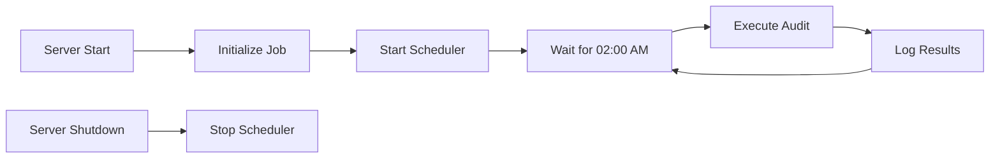

# Night Audit Module - Quick Reference

## Overview

The Night Audit module is a background job that runs automatically every day at 02:00 AM to update the housekeeping status of occupied rooms. This ensures that all occupied rooms are marked as "Dirty" at the start of each day, reflecting the need for housekeeping services.

## Features

### Automatic Scheduling
- **Schedule**: Runs daily at 02:00 AM
- **Cron Expression**: `0 2 * * *`
- **Automatic Start**: Starts when the server starts
- **Graceful Shutdown**: Stops cleanly when the server shuts down

### Night Audit Process
1. Identifies all rooms with `occupancy_status = 'Occupied'`
2. Updates their `housekeeping_status` to `'Dirty'`
3. Logs the number of rooms updated
4. Records execution time and results

### Error Handling
- Timeout protection (30 seconds)
- Database error handling
- Comprehensive logging
- Email alerts on failure (configurable)

### Manual Trigger
- Can be triggered manually via API
- Useful for testing and emergency situations
- Returns detailed execution results

## Architecture

### Components

```
backend/
├── internal/
│   ├── jobs/
│   │   ├── night_audit.go          # Main night audit job
│   │   └── night_audit_test.go     # Unit tests
│   └── handlers/
│       └── night_audit_handler.go  # API endpoints
└── cmd/
    └── server/
        └── main.go                  # Job initialization
```

### Job Lifecycle



## API Endpoints

### 1. Trigger Manual Night Audit

**Endpoint**: `POST /api/admin/night-audit/trigger`

**Authentication**: Required (Manager role)

**Description**: Manually triggers the night audit process

**Request**:
```bash
curl -X POST http://localhost:8080/api/admin/night-audit/trigger \
  -H "Authorization: Bearer YOUR_TOKEN"
```

**Response** (Success - 200):
```json
{
  "message": "Night audit completed successfully",
  "timestamp": "2024-01-15T02:00:00Z",
  "rooms_updated": 15,
  "execution_time": "125ms"
}
```

**Response** (Error - 500):
```json
{
  "error": "Failed to run night audit",
  "details": "database connection timeout"
}
```

### 2. Get Night Audit Status

**Endpoint**: `GET /api/admin/night-audit/status`

**Authentication**: Required (Manager role)

**Description**: Returns the current status of the night audit scheduler

**Request**:
```bash
curl -X GET http://localhost:8080/api/admin/night-audit/status \
  -H "Authorization: Bearer YOUR_TOKEN"
```

**Response** (200):
```json
{
  "is_running": true,
  "next_run": "2024-01-16T02:00:00Z",
  "schedule": "Daily at 02:00 AM"
}
```

## Database Operations

### SQL Query Executed

```sql
UPDATE rooms
SET housekeeping_status = 'Dirty'
WHERE occupancy_status = 'Occupied'
  AND housekeeping_status != 'Dirty'
RETURNING room_id;
```

### Affected Tables
- `rooms` - Updates `housekeeping_status` column

### Transaction Safety
- Uses database transactions
- Atomic operations
- Rollback on error

## Logging

### Log Format

```
[NIGHT-AUDIT] 2024-01-15 02:00:00 Starting scheduled night audit...
[NIGHT-AUDIT] 2024-01-15 02:00:00 Executing night audit process...
[NIGHT-AUDIT] 2024-01-15 02:00:00 Night audit completed successfully: 15 rooms updated in 125ms
[NIGHT-AUDIT] 2024-01-15 02:00:00 Updated room IDs: [101, 102, 103, ...]
[NIGHT-AUDIT] 2024-01-15 02:00:00 ✓ Night Audit Success | Time: 2024-01-15 02:00:00 | Rooms Updated: 15 | Duration: 125ms
```

### Log Levels
- **INFO**: Normal operations
- **WARNING**: Non-critical issues
- **ERROR**: Failures and exceptions

## Configuration

### Environment Variables

None required - uses existing database connection from main application.

### Cron Schedule

To change the schedule, modify the cron expression in `night_audit.go`:

```go
// Current: Daily at 02:00 AM
_, err := j.cron.AddFunc("0 2 * * *", func() { ... })

// Examples:
// Every hour: "0 * * * *"
// Every 30 minutes: "*/30 * * * *"
// At 3:30 AM: "30 3 * * *"
```

## Testing

### Unit Tests

Run unit tests:
```bash
cd backend
go test ./internal/jobs -v
```

### Integration Testing

1. **Setup Test Data**:
```sql
-- Create occupied rooms with clean status
UPDATE rooms 
SET occupancy_status = 'Occupied',
    housekeeping_status = 'Clean'
WHERE room_id IN (1, 2, 3);
```

2. **Run Test Script**:
```powershell
.\test_night_audit.ps1
```

3. **Verify Results**:
```sql
-- Check that rooms are now dirty
SELECT room_id, room_number, occupancy_status, housekeeping_status
FROM rooms
WHERE occupancy_status = 'Occupied';
```

### Manual Testing

1. **Check Status**:
```bash
curl -X GET http://localhost:8080/api/admin/night-audit/status \
  -H "Authorization: Bearer YOUR_TOKEN"
```

2. **Trigger Manually**:
```bash
curl -X POST http://localhost:8080/api/admin/night-audit/trigger \
  -H "Authorization: Bearer YOUR_TOKEN"
```

3. **Verify in Database**:
```sql
SELECT COUNT(*) 
FROM rooms 
WHERE occupancy_status = 'Occupied' 
  AND housekeeping_status = 'Dirty';
```

## Monitoring

### Health Checks

Monitor the night audit job:
- Check server logs for `[NIGHT-AUDIT]` entries
- Verify next run time via status endpoint
- Monitor execution time trends

### Alerts

Set up alerts for:
- Failed night audit executions
- Execution time > 5 seconds
- No rooms updated when expected

### Metrics to Track

- Number of rooms updated per run
- Execution time
- Success/failure rate
- Last successful run timestamp

## Troubleshooting

### Issue: Night Audit Not Running

**Symptoms**: No log entries at 02:00 AM

**Solutions**:
1. Check if server is running
2. Verify scheduler status via API
3. Check server timezone settings
4. Review server logs for errors

### Issue: Database Timeout

**Symptoms**: "database connection timeout" error

**Solutions**:
1. Check database connection pool settings
2. Verify database is accessible
3. Increase timeout in code if needed
4. Check for long-running queries

### Issue: No Rooms Updated

**Symptoms**: `rooms_updated: 0` in response

**Possible Causes**:
1. No occupied rooms in database
2. All occupied rooms already marked as dirty
3. Database constraint preventing update

**Verification**:
```sql
-- Check occupied rooms
SELECT COUNT(*) 
FROM rooms 
WHERE occupancy_status = 'Occupied';

-- Check occupied rooms not dirty
SELECT COUNT(*) 
FROM rooms 
WHERE occupancy_status = 'Occupied' 
  AND housekeeping_status != 'Dirty';
```

## Best Practices

### 1. Regular Monitoring
- Check logs daily for successful execution
- Monitor execution time trends
- Set up automated alerts

### 2. Testing
- Test manually after deployment
- Verify with sample data
- Include in integration test suite

### 3. Backup Strategy
- Ensure database backups before 02:00 AM
- Keep audit logs for compliance
- Document any manual interventions

### 4. Performance
- Monitor execution time
- Optimize if processing > 1000 rooms
- Consider batching for large hotels

## Requirements Mapping

This module satisfies the following requirements:

- **18.1**: Night audit runs automatically at scheduled time (02:00 AM)
- **18.2**: Updates occupied rooms to dirty status
- **18.3**: Scheduled execution daily
- **18.4**: Comprehensive error handling
- **18.5**: Detailed logging of operations
- **18.6**: Alert mechanism for failures

## Future Enhancements

Potential improvements:
1. Email notifications on completion/failure
2. Detailed audit reports
3. Configurable schedule via admin UI
4. Historical execution tracking
5. Integration with reporting module
6. Slack/Teams notifications
7. Retry mechanism for failures

## Related Documentation

- [Housekeeping Module](./HOUSEKEEPING_MODULE_REFERENCE.md)
- [Room Management](./ROOM_SEARCH_QUICK_REFERENCE.md)
- [Check-in/Check-out](./CHECKIN_CHECKOUT_REFERENCE.md)

## Support

For issues or questions:
1. Check server logs: `[NIGHT-AUDIT]` entries
2. Review this documentation
3. Test manually via API
4. Contact system administrator
