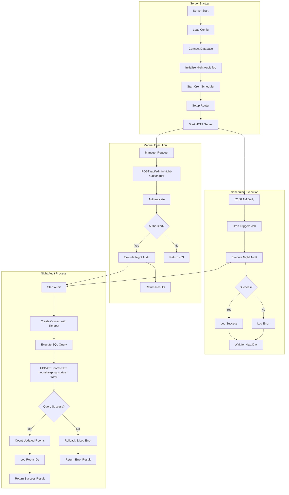
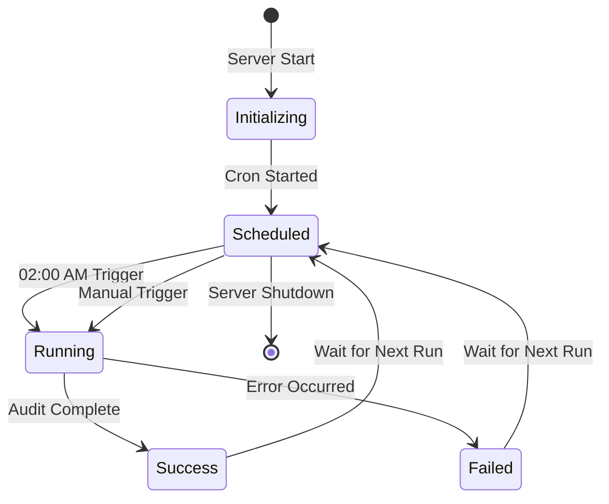
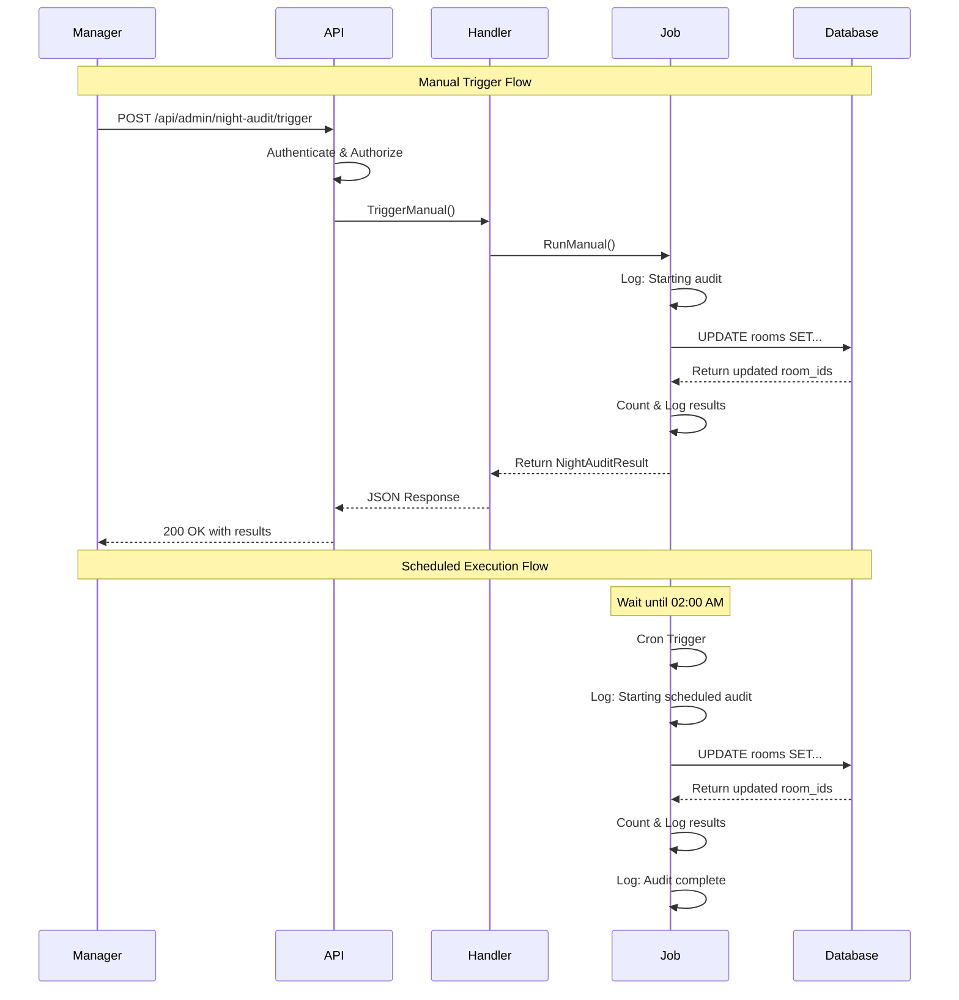

# Night Audit Workflow Diagram

## System Architecture



## Detailed Flow

### 1. Server Startup Flow

```
┌─────────────────┐
│  Server Start   │
└────────┬────────┘
         │
         ▼
┌─────────────────┐
│  Load Config    │
└────────┬────────┘
         │
         ▼
┌─────────────────┐
│ Connect to DB   │
└────────┬────────┘
         │
         ▼
┌─────────────────────────────┐
│ Initialize Night Audit Job  │
│ - Create job instance       │
│ - Setup logger              │
│ - Create cron scheduler     │
└────────┬────────────────────┘
         │
         ▼
┌─────────────────────────────┐
│   Start Cron Scheduler      │
│ - Schedule: 0 2 * * *       │
│ - Next run: Tomorrow 02:00  │
└────────┬────────────────────┘
         │
         ▼
┌─────────────────┐
│  Setup Router   │
│ - Add routes    │
│ - Add handlers  │
└────────┬────────┘
         │
         ▼
┌─────────────────┐
│ Start HTTP Srv  │
│ Port: 8080      │
└─────────────────┘
```

### 2. Scheduled Execution Flow

```
┌──────────────────┐
│  Wait for 02:00  │
│  (Cron Waits)    │
└────────┬─────────┘
         │
         ▼ (02:00 AM)
┌──────────────────┐
│  Cron Triggers   │
└────────┬─────────┘
         │
         ▼
┌──────────────────────────┐
│  Log: Starting audit...  │
└────────┬─────────────────┘
         │
         ▼
┌──────────────────────────┐
│  Execute Night Audit     │
│  (See Process Flow)      │
└────────┬─────────────────┘
         │
         ▼
┌──────────────────────────┐
│  Log Results             │
│  - Timestamp             │
│  - Rooms updated         │
│  - Execution time        │
│  - Success/Error         │
└────────┬─────────────────┘
         │
         ▼
┌──────────────────┐
│  Wait 24 hours   │
│  (Next 02:00)    │
└──────────────────┘
```

### 3. Manual Trigger Flow

```
┌─────────────────────┐
│  Manager Login      │
│  Get JWT Token      │
└──────────┬──────────┘
           │
           ▼
┌─────────────────────────────────┐
│  POST /api/admin/night-audit/   │
│       trigger                    │
│  Header: Authorization: Bearer  │
└──────────┬──────────────────────┘
           │
           ▼
┌─────────────────────┐
│  Auth Middleware    │
│  - Verify JWT       │
│  - Check role       │
└──────────┬──────────┘
           │
           ▼
      ┌────┴────┐
      │ Valid?  │
      └────┬────┘
           │
    ┌──────┴──────┐
    │             │
    ▼             ▼
┌────────┐   ┌────────┐
│  Yes   │   │   No   │
└───┬────┘   └───┬────┘
    │            │
    │            ▼
    │      ┌──────────┐
    │      │ Return   │
    │      │ 401/403  │
    │      └──────────┘
    │
    ▼
┌─────────────────────┐
│  Execute Audit      │
│  (See Process Flow) │
└──────────┬──────────┘
           │
           ▼
┌─────────────────────┐
│  Return JSON        │
│  {                  │
│    message: "..."   │
│    rooms_updated: N │
│    execution_time   │
│  }                  │
└─────────────────────┘
```

### 4. Night Audit Process Flow

```
┌──────────────────────┐
│  Start Audit         │
│  Log: Executing...   │
└──────────┬───────────┘
           │
           ▼
┌──────────────────────┐
│  Create Context      │
│  Timeout: 30 seconds │
└──────────┬───────────┘
           │
           ▼
┌──────────────────────────────────┐
│  Execute SQL Query               │
│  UPDATE rooms                    │
│  SET housekeeping_status='Dirty' │
│  WHERE occupancy_status='Occupied'│
│  AND housekeeping_status!='Dirty'│
│  RETURNING room_id;              │
└──────────┬───────────────────────┘
           │
           ▼
      ┌────┴────┐
      │Success? │
      └────┬────┘
           │
    ┌──────┴──────┐
    │             │
    ▼             ▼
┌────────┐   ┌────────┐
│  Yes   │   │   No   │
└───┬────┘   └───┬────┘
    │            │
    │            ▼
    │      ┌──────────────────┐
    │      │  Log Error       │
    │      │  Return Error    │
    │      │  Result          │
    │      └──────────────────┘
    │
    ▼
┌──────────────────┐
│  Scan Results    │
│  Count rooms     │
│  Collect IDs     │
└──────────┬───────┘
           │
           ▼
┌──────────────────┐
│  Log Success     │
│  - Rooms updated │
│  - Room IDs      │
│  - Duration      │
└──────────┬───────┘
           │
           ▼
┌──────────────────┐
│  Return Success  │
│  Result          │
└──────────────────┘
```

## State Diagram



## Sequence Diagram



## Data Flow

```
┌─────────────┐
│   Rooms     │
│   Table     │
└──────┬──────┘
       │
       │ SELECT (Identify)
       ▼
┌─────────────────────────┐
│  Occupied Rooms         │
│  (occupancy='Occupied') │
│  (housekeeping!='Dirty')│
└──────┬──────────────────┘
       │
       │ UPDATE
       ▼
┌─────────────────────────┐
│  Set Status to Dirty    │
│  housekeeping='Dirty'   │
└──────┬──────────────────┘
       │
       │ RETURN
       ▼
┌─────────────────────────┐
│  Updated Room IDs       │
│  [101, 102, 103, ...]   │
└──────┬──────────────────┘
       │
       │ LOG
       ▼
┌─────────────────────────┐
│  Audit Log              │
│  - Timestamp            │
│  - Count                │
│  - Room IDs             │
│  - Duration             │
└─────────────────────────┘
```

## Error Handling Flow

```
┌──────────────────┐
│  Execute Query   │
└────────┬─────────┘
         │
         ▼
    ┌────┴────┐
    │ Error?  │
    └────┬────┘
         │
    ┌────┴────┐
    │         │
    ▼         ▼
┌────────┐ ┌──────────────┐
│   No   │ │     Yes      │
└───┬────┘ └──────┬───────┘
    │             │
    │             ▼
    │      ┌──────────────────┐
    │      │  Identify Error  │
    │      │  - Connection    │
    │      │  - Timeout       │
    │      │  - SQL Error     │
    │      └──────┬───────────┘
    │             │
    │             ▼
    │      ┌──────────────────┐
    │      │  Log Error       │
    │      │  - Type          │
    │      │  - Message       │
    │      │  - Stack trace   │
    │      └──────┬───────────┘
    │             │
    │             ▼
    │      ┌──────────────────┐
    │      │  Return Error    │
    │      │  Result          │
    │      │  - Success=false │
    │      │  - ErrorMessage  │
    │      └──────────────────┘
    │
    ▼
┌──────────────────┐
│  Process Results │
│  Return Success  │
└──────────────────┘
```

## Component Interaction

```
┌─────────────────────────────────────────────────────┐
│                    Server Process                    │
│                                                      │
│  ┌──────────────┐         ┌──────────────┐         │
│  │   HTTP       │         │   Cron       │         │
│  │   Server     │         │   Scheduler  │         │
│  └──────┬───────┘         └──────┬───────┘         │
│         │                        │                  │
│         │                        │                  │
│         ▼                        ▼                  │
│  ┌──────────────┐         ┌──────────────┐         │
│  │   Router     │         │  Night Audit │         │
│  │              │         │     Job      │         │
│  └──────┬───────┘         └──────┬───────┘         │
│         │                        │                  │
│         ▼                        │                  │
│  ┌──────────────┐                │                  │
│  │   Handler    │◄───────────────┘                  │
│  │              │                                   │
│  └──────┬───────┘                                   │
│         │                                           │
│         ▼                                           │
│  ┌──────────────┐                                   │
│  │   Database   │                                   │
│  │   Pool       │                                   │
│  └──────────────┘                                   │
│                                                      │
└─────────────────────────────────────────────────────┘
```

## Logging Flow

```
┌──────────────┐
│  Log Event   │
└──────┬───────┘
       │
       ▼
┌──────────────────┐
│  Format Message  │
│  [NIGHT-AUDIT]   │
│  Timestamp       │
│  Message         │
└──────┬───────────┘
       │
       ▼
┌──────────────────┐
│  Write to Log    │
│  - Console       │
│  - File (if cfg) │
└──────┬───────────┘
       │
       ▼
┌──────────────────┐
│  Log Stored      │
│  Available for   │
│  Monitoring      │
└──────────────────┘
```

## Summary

The night audit system follows a clean, predictable workflow:

1. **Initialization**: Job is created and scheduled when server starts
2. **Scheduling**: Cron waits for 02:00 AM daily
3. **Execution**: Updates occupied rooms to dirty status
4. **Logging**: Records all activities with timestamps
5. **Manual Control**: Managers can trigger anytime via API
6. **Error Handling**: Comprehensive error catching and logging
7. **Graceful Shutdown**: Stops cleanly when server stops

All flows are designed for reliability, observability, and maintainability.
