# Booking Module Flow Diagrams

## Complete Booking Flow

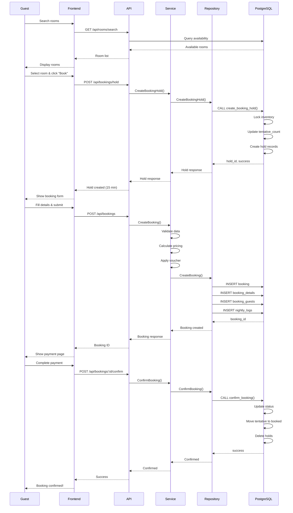

## Booking Hold Flow

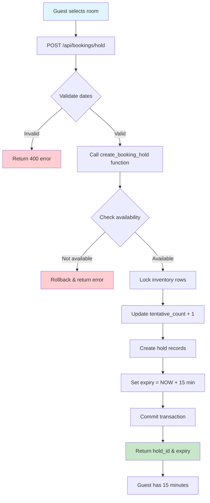

## Booking Confirmation Flow

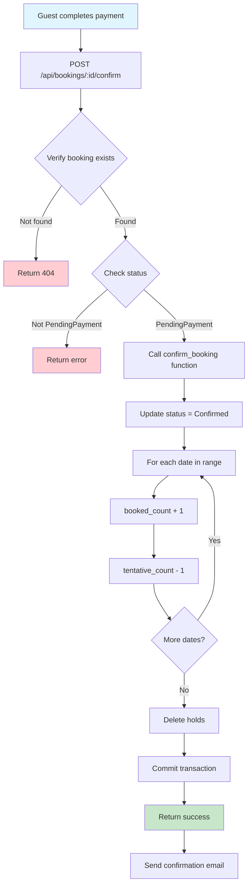

## Booking Cancellation Flow

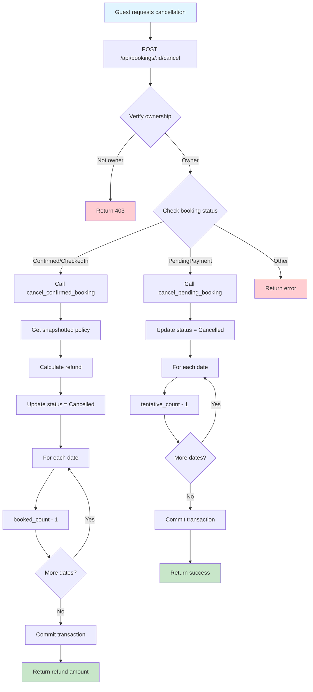

## Data Flow Architecture

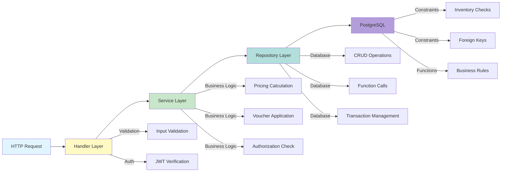

## Inventory State Changes

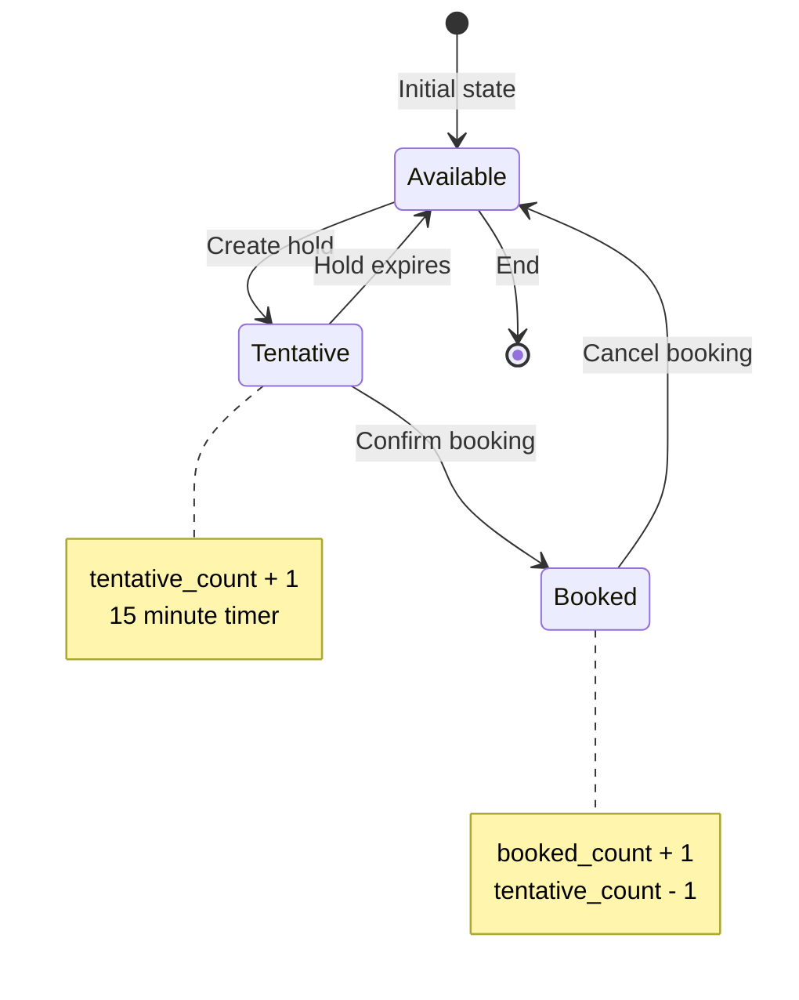

## Booking Status Lifecycle

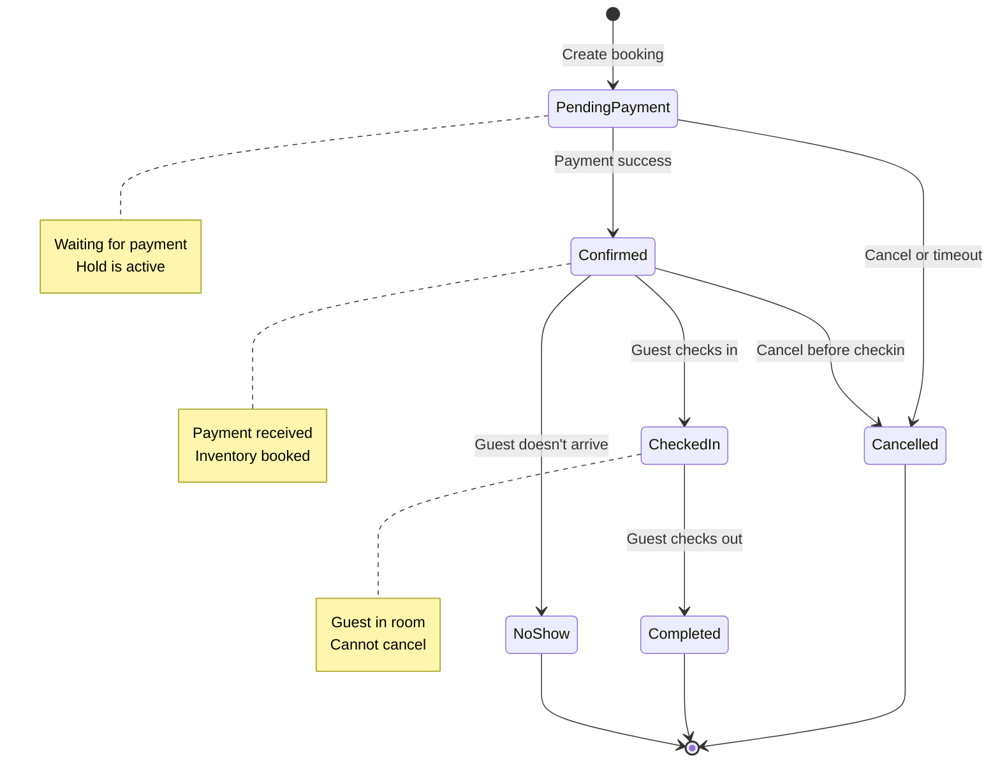

## Error Handling Flow

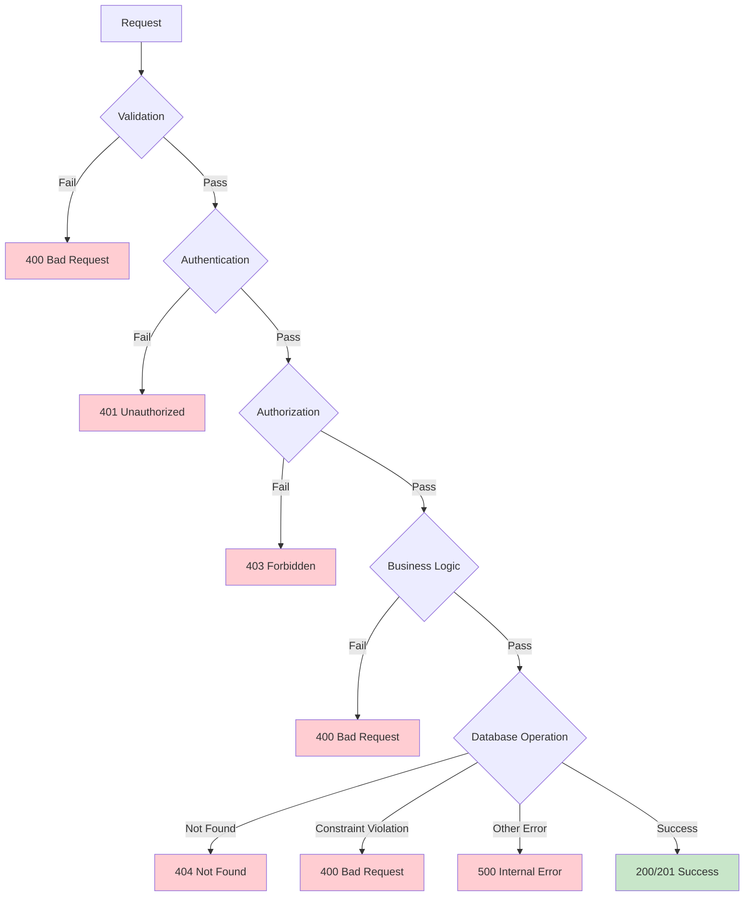

## Concurrent Booking Scenario

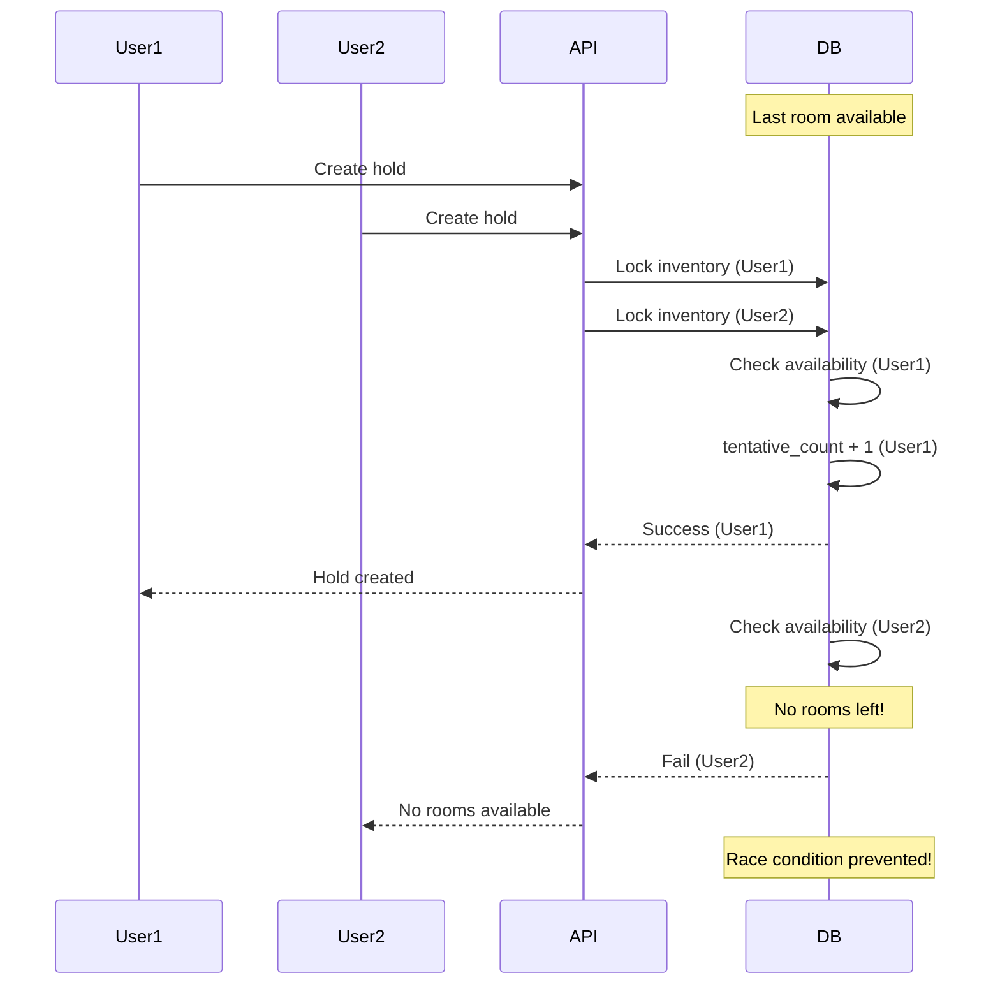

## Database Transaction Flow

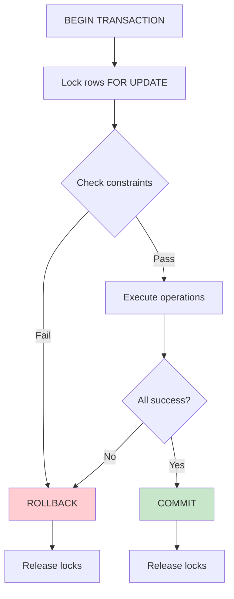

## Key Design Principles

### 1. Atomicity
All critical operations use database transactions to ensure all-or-nothing execution.

### 2. Isolation
Row-level locks prevent race conditions during concurrent bookings.

### 3. Consistency
Database constraints and functions enforce business rules.

### 4. Durability
Committed transactions are permanently stored.

### 5. Authorization
Service layer checks ensure users can only access their own data.

### 6. Immutability
Policy and pricing snapshots preserve historical accuracy.

## Performance Considerations

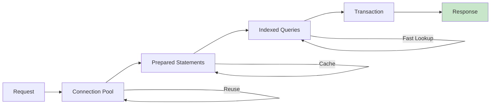

## Security Layers

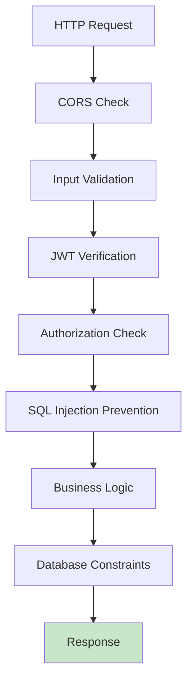

These diagrams illustrate the complete booking flow, state transitions, error handling, and security measures implemented in the booking module.
