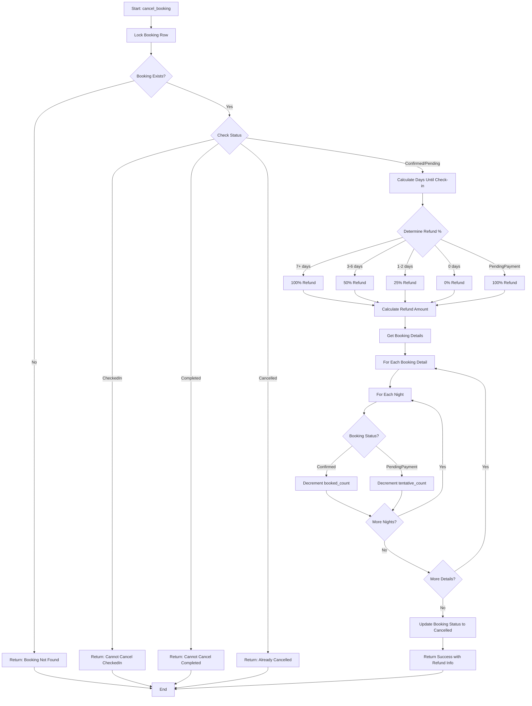
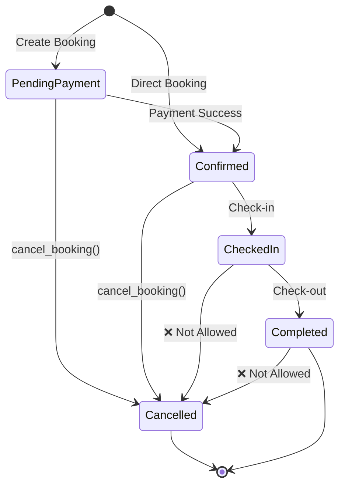

# Cancel Booking Flow

## Overview

This document describes the complete flow of the `cancel_booking` function, including all validation steps, inventory updates, and refund calculations.

## Flow Diagram



## Detailed Steps

### 1. Initial Validation

```sql
-- Lock the booking row
SELECT b.status, b.total_amount, b.policy_description,
       MIN(bd.check_in_date) as earliest_checkin
FROM bookings b
JOIN booking_details bd ON b.booking_id = bd.booking_id
WHERE b.booking_id = p_booking_id
GROUP BY b.booking_id
FOR UPDATE OF b;
```

**Checks:**
- ✅ Booking exists
- ✅ Booking is not already cancelled
- ✅ Booking is not CheckedIn
- ✅ Booking is not Completed

### 2. Refund Calculation

```sql
-- Calculate days until check-in
v_days_until_checkin := v_check_in_date - CURRENT_DATE;

-- Determine refund percentage
IF v_status = 'PendingPayment' THEN
    v_refund_pct := 100.00;
ELSIF v_days_until_checkin >= 7 THEN
    v_refund_pct := 100.00;
ELSIF v_days_until_checkin >= 3 THEN
    v_refund_pct := 50.00;
ELSIF v_days_until_checkin >= 1 THEN
    v_refund_pct := 25.00;
ELSE
    v_refund_pct := 0.00;
END IF;

-- Calculate refund amount
v_refund_amt := v_total_amount * (v_refund_pct / 100);
```

### 3. Inventory Return

For each booking detail and each night:

#### Confirmed Bookings
```sql
UPDATE room_inventory
SET booked_count = GREATEST(booked_count - 1, 0)
WHERE room_type_id = v_detail.room_type_id 
  AND date = v_date;
```

#### PendingPayment Bookings
```sql
UPDATE room_inventory
SET tentative_count = GREATEST(tentative_count - 1, 0)
WHERE room_type_id = v_detail.room_type_id 
  AND date = v_date;
```

### 4. Status Update

```sql
UPDATE bookings
SET status = 'Cancelled',
    updated_at = CURRENT_TIMESTAMP
WHERE booking_id = p_booking_id;
```

### 5. Return Result

```sql
RETURN QUERY SELECT 
    TRUE,
    'ยกเลิกการจองสำเร็จ',
    v_refund_amt,
    v_refund_pct;
```

## Example Scenarios

### Scenario 1: Cancel Confirmed Booking (10 days before)

**Input:**
- Booking ID: 123
- Status: Confirmed
- Check-in: 10 days from now
- Total Amount: 6000.00

**Process:**
1. Lock booking ✓
2. Validate status ✓
3. Calculate days: 10
4. Determine refund: 100% (7+ days)
5. Calculate amount: 6000.00
6. Return inventory: booked_count - 1 for each night
7. Update status: Cancelled
8. Return: success=true, refund=6000.00, percentage=100.00

**Inventory Changes:**
```
Before:  allotment=10, booked_count=5, tentative_count=2, available=3
After:   allotment=10, booked_count=4, tentative_count=2, available=4
```

### Scenario 2: Cancel PendingPayment Booking

**Input:**
- Booking ID: 456
- Status: PendingPayment
- Check-in: 5 days from now
- Total Amount: 4000.00

**Process:**
1. Lock booking ✓
2. Validate status ✓
3. Status is PendingPayment
4. Refund: 100% (no payment made)
5. Calculate amount: 4000.00
6. Return inventory: tentative_count - 1 for each night
7. Update status: Cancelled
8. Return: success=true, refund=4000.00, percentage=100.00

**Inventory Changes:**
```
Before:  allotment=10, booked_count=5, tentative_count=2, available=3
After:   allotment=10, booked_count=5, tentative_count=1, available=4
```

### Scenario 3: Attempt to Cancel CheckedIn Booking

**Input:**
- Booking ID: 789
- Status: CheckedIn

**Process:**
1. Lock booking ✓
2. Validate status ✗ (CheckedIn)
3. Return: success=false, message="Cannot cancel CheckedIn booking"

**Inventory Changes:**
```
No changes - cancellation rejected
```

## State Transitions



## Inventory Impact

### Before Cancellation
```
Room Type: Deluxe
Date: 2024-01-15

┌─────────────┬───────────────┬─────────────────┬───────────┐
│  Allotment  │ Booked Count  │ Tentative Count │ Available │
├─────────────┼───────────────┼─────────────────┼───────────┤
│     10      │       5       │        2        │     3     │
└─────────────┴───────────────┴─────────────────┴───────────┘
```

### After Cancelling Confirmed Booking
```
Room Type: Deluxe
Date: 2024-01-15

┌─────────────┬───────────────┬─────────────────┬───────────┐
│  Allotment  │ Booked Count  │ Tentative Count │ Available │
├─────────────┼───────────────┼─────────────────┼───────────┤
│     10      │       4       │        2        │     4     │
└─────────────┴───────────────┴─────────────────┴───────────┘
                    ↓ -1                              ↑ +1
```

### After Cancelling PendingPayment Booking
```
Room Type: Deluxe
Date: 2024-01-15

┌─────────────┬───────────────┬─────────────────┬───────────┐
│  Allotment  │ Booked Count  │ Tentative Count │ Available │
├─────────────┼───────────────┼─────────────────┼───────────┤
│     10      │       5       │        1        │     4     │
└─────────────┴───────────────┴─────────────────┴───────────┘
                                     ↓ -1              ↑ +1
```

## Refund Calculation Examples

### Example 1: Full Refund (7+ days)
```
Total Amount: 6000.00 THB
Days Until Check-in: 10
Refund Percentage: 100%
Refund Amount: 6000.00 THB
```

### Example 2: Partial Refund (3-6 days)
```
Total Amount: 6000.00 THB
Days Until Check-in: 5
Refund Percentage: 50%
Refund Amount: 3000.00 THB
```

### Example 3: Minimal Refund (1-2 days)
```
Total Amount: 6000.00 THB
Days Until Check-in: 2
Refund Percentage: 25%
Refund Amount: 1500.00 THB
```

### Example 4: No Refund (Same day)
```
Total Amount: 6000.00 THB
Days Until Check-in: 0
Refund Percentage: 0%
Refund Amount: 0.00 THB
```

## Error Handling

### Error 1: Booking Not Found
```sql
-- Input: booking_id = 99999
-- Output: success=false, message="ไม่พบการจองนี้"
```

### Error 2: Already Cancelled
```sql
-- Input: booking_id = 123 (status = 'Cancelled')
-- Output: success=false, message="การจองนี้ถูกยกเลิกแล้ว"
```

### Error 3: Cannot Cancel CheckedIn
```sql
-- Input: booking_id = 456 (status = 'CheckedIn')
-- Output: success=false, message="ไม่สามารถยกเลิกการจองที่มีสถานะ CheckedIn ได้"
```

## Performance Considerations

1. **Locking Strategy**
   - Uses `FOR UPDATE OF b` to lock only the booking row
   - Minimizes lock contention
   - Allows concurrent cancellations of different bookings

2. **Batch Updates**
   - Updates inventory for all nights in a loop
   - Each update is atomic
   - Uses `GREATEST(count - 1, 0)` to prevent negative counts

3. **Index Usage**
   - Uses primary key index on bookings
   - Uses composite index on room_inventory (room_type_id, date)
   - Efficient for multi-night bookings

## Integration Points

### Backend API
```go
POST /api/bookings/:id/cancel
Body: {
  "reason": "Customer requested cancellation"
}

Response: {
  "success": true,
  "message": "ยกเลิกการจองสำเร็จ",
  "refund_amount": 6000.00,
  "refund_percentage": 100.00
}
```

### Email Notification
After successful cancellation:
- Send cancellation confirmation email
- Include refund amount and percentage
- Provide refund processing timeline
- Include cancellation policy reference

### Audit Trail
The function maintains:
- Updated booking status
- Updated timestamp
- Inventory changes (implicit through updates)
- Cancellation reason (in message)

## See Also

- [CANCEL_BOOKING_REFERENCE.md](CANCEL_BOOKING_REFERENCE.md) - Quick reference guide
- [test_cancel_booking_function.sql](test_cancel_booking_function.sql) - Test suite
- [Requirements](../../.kiro/specs/hotel-reservation-system/requirements.md) - Requirement 6
