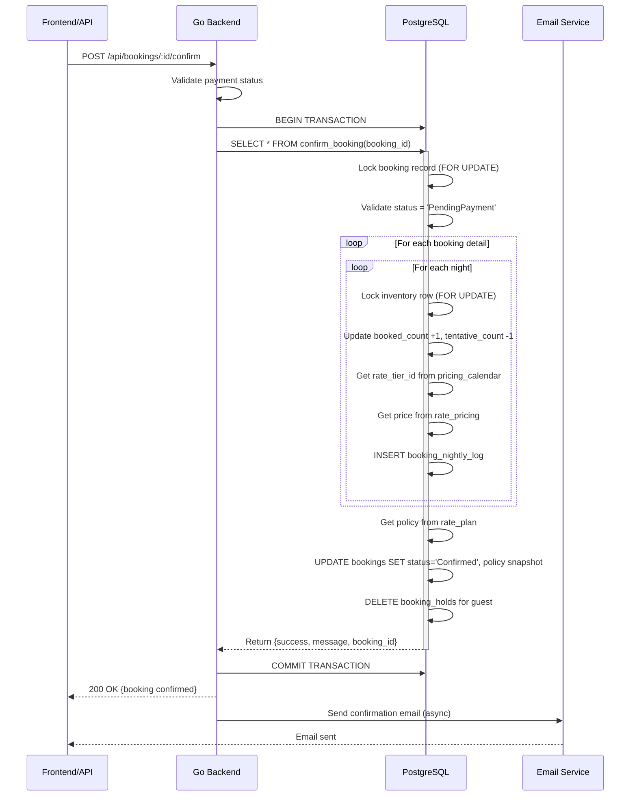

# Confirm Booking Flow - แผนภาพและการทำงาน

## ภาพรวม Flow



## Detailed Flow Diagram

### 1. Entry Point

```
┌─────────────────────────────────────────────────────────────┐
│                    confirm_booking(p_booking_id)            │
│                                                             │
│  Input:  booking_id (INT)                                  │
│  Output: TABLE(success BOOLEAN, message TEXT, booking_id)  │
└─────────────────────────────────────────────────────────────┘
                              │
                              ▼
```

### 2. Validation Phase

```
┌─────────────────────────────────────────────────────────────┐
│                    STEP 1: Validate Booking                 │
└─────────────────────────────────────────────────────────────┘
                              │
                              ▼
                    ┌─────────────────┐
                    │ Lock booking    │
                    │ (FOR UPDATE)    │
                    └─────────────────┘
                              │
                              ▼
                    ┌─────────────────┐
                    │ Booking exists? │
                    └─────────────────┘
                         │         │
                    Yes  │         │ No
                         │         └──────► Return error
                         ▼                  "ไม่พบการจอง"
                    ┌─────────────────┐
                    │ Status =        │
                    │ PendingPayment? │
                    └─────────────────┘
                         │         │
                    Yes  │         │ No
                         │         └──────► Return error
                         ▼                  "สถานะไม่ถูกต้อง"
                    Continue
```

### 3. Inventory Update Phase

```
┌─────────────────────────────────────────────────────────────┐
│              STEP 2: Update Inventory (Atomic)              │
└─────────────────────────────────────────────────────────────┘
                              │
                              ▼
                    ┌─────────────────┐
                    │ Get all booking │
                    │ details         │
                    └─────────────────┘
                              │
                              ▼
        ┌─────────────────────────────────────────┐
        │  FOR EACH booking_detail                │
        │  ┌───────────────────────────────────┐  │
        │  │ FOR EACH night in date range      │  │
        │  │  ┌─────────────────────────────┐  │  │
        │  │  │ Lock inventory row          │  │  │
        │  │  │ (FOR UPDATE)                │  │  │
        │  │  └─────────────────────────────┘  │  │
        │  │              │                     │  │
        │  │              ▼                     │  │
        │  │  ┌─────────────────────────────┐  │  │
        │  │  │ Check availability          │  │  │
        │  │  │ (should have tentative)     │  │  │
        │  │  └─────────────────────────────┘  │  │
        │  │              │                     │  │
        │  │              ▼                     │  │
        │  │  ┌─────────────────────────────┐  │  │
        │  │  │ UPDATE room_inventory       │  │  │
        │  │  │ SET booked_count = +1       │  │  │
        │  │  │     tentative_count = -1    │  │  │
        │  │  └─────────────────────────────┘  │  │
        │  └───────────────────────────────────┘  │
        └─────────────────────────────────────────┘
                              │
                              ▼
```

### 4. Nightly Log Phase

```
┌─────────────────────────────────────────────────────────────┐
│              STEP 3: Record Nightly Pricing                 │
└─────────────────────────────────────────────────────────────┘
                              │
                              ▼
        ┌─────────────────────────────────────────┐
        │  FOR EACH night                         │
        │  ┌───────────────────────────────────┐  │
        │  │ Get rate_tier_id                  │  │
        │  │ FROM pricing_calendar             │  │
        │  └───────────────────────────────────┘  │
        │              │                           │
        │              ▼                           │
        │  ┌───────────────────────────────────┐  │
        │  │ Get price                         │  │
        │  │ FROM rate_pricing                 │  │
        │  │ WHERE rate_plan_id, room_type_id, │  │
        │  │       rate_tier_id                │  │
        │  └───────────────────────────────────┘  │
        │              │                           │
        │              ▼                           │
        │  ┌───────────────────────────────────┐  │
        │  │ INSERT booking_nightly_log        │  │
        │  │ (booking_detail_id, date, price)  │  │
        │  └───────────────────────────────────┘  │
        └─────────────────────────────────────────┘
                              │
                              ▼
```

### 5. Policy Snapshot Phase

```
┌─────────────────────────────────────────────────────────────┐
│              STEP 4: Record Policy Snapshot                 │
└─────────────────────────────────────────────────────────────┘
                              │
                              ▼
                    ┌─────────────────┐
                    │ Get policy from │
                    │ rate_plan       │
                    └─────────────────┘
                              │
                              ▼
                    ┌─────────────────┐
                    │ Policy exists?  │
                    └─────────────────┘
                         │         │
                    Yes  │         │ No
                         │         └──────► Use default
                         ▼                  "No Refund"
                    ┌─────────────────┐
                    │ Store policy    │
                    │ name & desc     │
                    └─────────────────┘
                              │
                              ▼
```

### 6. Finalization Phase

```
┌─────────────────────────────────────────────────────────────┐
│              STEP 5: Update Booking Status                  │
└─────────────────────────────────────────────────────────────┘
                              │
                              ▼
                    ┌─────────────────┐
                    │ UPDATE bookings │
                    │ SET             │
                    │  status='Conf'  │
                    │  policy_name    │
                    │  policy_desc    │
                    │  updated_at     │
                    └─────────────────┘
                              │
                              ▼
┌─────────────────────────────────────────────────────────────┐
│              STEP 6: Cleanup Booking Holds                  │
└─────────────────────────────────────────────────────────────┘
                              │
                              ▼
                    ┌─────────────────┐
                    │ DELETE FROM     │
                    │ booking_holds   │
                    │ WHERE guest_id  │
                    └─────────────────┘
                              │
                              ▼
┌─────────────────────────────────────────────────────────────┐
│              STEP 7: Return Success                         │
└─────────────────────────────────────────────────────────────┘
                              │
                              ▼
                    ┌─────────────────┐
                    │ RETURN TABLE    │
                    │ success=TRUE    │
                    │ message="..."   │
                    │ booking_id=X    │
                    └─────────────────┘
```

## State Transition Diagram


## Data Flow Diagram


## Inventory State Changes

### Before Confirmation

```
room_inventory (2025-01-15, Standard Room)
┌──────────┬──────────────┬─────────────────┬───────────┐
│ allotment│ booked_count │ tentative_count │ available │
├──────────┼──────────────┼─────────────────┼───────────┤
│    10    │      5       │        2        │     3     │
└──────────┴──────────────┴─────────────────┴───────────┘
```

### After Confirmation

```
room_inventory (2025-01-15, Standard Room)
┌──────────┬──────────────┬─────────────────┬───────────┐
│ allotment│ booked_count │ tentative_count │ available │
├──────────┼──────────────┼─────────────────┼───────────┤
│    10    │      6       │        1        │     3     │
└──────────┴──────────────┴─────────────────┴───────────┘
                ↑                    ↑
               +1                   -1
```

## Locking Strategy

### Row-Level Locking

```sql
-- 1. Lock booking (prevents concurrent confirms)
SELECT * FROM bookings WHERE booking_id = X FOR UPDATE;

-- 2. Lock inventory (prevents race conditions)
SELECT * FROM room_inventory 
WHERE room_type_id = Y AND date = Z 
FOR UPDATE;
```

### Lock Hierarchy

```
Transaction Start
    │
    ├─► Lock Booking (booking_id)
    │   └─► Prevents: Concurrent confirms, cancels
    │
    ├─► Lock Inventory (room_type_id, date)
    │   └─► Prevents: Overbooking, race conditions
    │
    └─► Commit/Rollback
```

## Error Scenarios

### Scenario 1: Booking Not Found

```
Input: booking_id = 99999
       ↓
Check booking exists
       ↓
NOT FOUND
       ↓
Return: {success: false, message: "ไม่พบการจองนี้"}
```

### Scenario 2: Invalid Status

```
Input: booking_id = 123 (status = 'Confirmed')
       ↓
Check status = 'PendingPayment'
       ↓
FAILED (status = 'Confirmed')
       ↓
Return: {success: false, message: "สถานะปัจจุบัน: Confirmed"}
```

### Scenario 3: Concurrent Confirmation

```
Transaction A                Transaction B
    │                            │
    ├─► Lock booking_id=123      │
    │   (acquired)               │
    │                            ├─► Lock booking_id=123
    │                            │   (waiting...)
    ├─► Update inventory         │
    ├─► Update booking           │
    ├─► COMMIT                   │
    │                            ├─► Lock acquired
    │                            ├─► Check status
    │                            ├─► FAILED (already Confirmed)
    │                            └─► ROLLBACK
```

## Performance Characteristics

### Time Complexity

| Operation | Complexity | Notes |
|-----------|-----------|-------|
| Lock booking | O(1) | Single row lookup |
| Lock inventory | O(n) | n = number of nights |
| Update inventory | O(n) | n = number of nights |
| Create nightly log | O(n) | n = number of nights |
| Update booking | O(1) | Single row update |
| Delete holds | O(m) | m = number of holds |

**Overall**: O(n) where n = total nights across all rooms

### Lock Duration

```
┌─────────────────────────────────────────────────────────┐
│ Transaction Timeline                                    │
├─────────────────────────────────────────────────────────┤
│                                                         │
│ BEGIN ──┬─► Lock Booking (1ms)                         │
│         │                                               │
│         ├─► Lock Inventory (n × 2ms)                   │
│         │                                               │
│         ├─► Update Inventory (n × 3ms)                 │
│         │                                               │
│         ├─► Create Nightly Log (n × 2ms)               │
│         │                                               │
│         ├─► Update Booking (2ms)                       │
│         │                                               │
│         └─► Delete Holds (1ms)                         │
│                                                         │
│ COMMIT ─────────────────────────────────────────────────│
│                                                         │
│ Total: ~10ms + (n × 7ms)                               │
│ Example: 3 nights = ~31ms                              │
└─────────────────────────────────────────────────────────┘
```

## Integration Points

### 1. Payment Gateway

```
Payment Gateway
       │
       ├─► Payment Success
       │       │
       │       ▼
       │   Backend receives webhook
       │       │
       │       ▼
       │   Validate payment
       │       │
       │       ▼
       └───► confirm_booking()
```

### 2. Email Service

```
confirm_booking() SUCCESS
       │
       ▼
Backend commits transaction
       │
       ▼
Async: Send confirmation email
       │
       ├─► Email template
       ├─► Booking details
       ├─► Policy information
       └─► QR code / Booking ID
```

### 3. Notification Service

```
confirm_booking() SUCCESS
       │
       ├─► Push notification (mobile app)
       ├─► SMS notification (optional)
       └─► Webhook to external systems
```

## Monitoring Points

### Key Metrics

1. **Confirmation Rate**
   ```sql
   SELECT 
       COUNT(*) FILTER (WHERE status = 'Confirmed') * 100.0 / COUNT(*) as rate
   FROM bookings
   WHERE created_at >= NOW() - INTERVAL '24 hours';
   ```

2. **Average Confirmation Time**
   ```sql
   SELECT 
       AVG(updated_at - created_at) as avg_time
   FROM bookings
   WHERE status = 'Confirmed'
     AND updated_at >= NOW() - INTERVAL '24 hours';
   ```

3. **Failed Confirmations**
   ```sql
   -- Monitor application logs for failed confirm_booking calls
   ```

### Alerts

- Confirmation rate < 90%
- Average confirmation time > 100ms
- Inventory violations detected
- Missing nightly logs for confirmed bookings

---

**เอกสารนี้แสดง:**
- ✅ Sequence diagram ของ flow ทั้งหมด
- ✅ Detailed step-by-step flow
- ✅ State transition diagram
- ✅ Data flow และ inventory changes
- ✅ Locking strategy
- ✅ Error scenarios
- ✅ Performance characteristics
- ✅ Integration points
- ✅ Monitoring metrics

**อัปเดตล่าสุด**: 2025-11-02
