# NextAuth.js Authentication Flow Diagrams

## 1. Sign In Flow

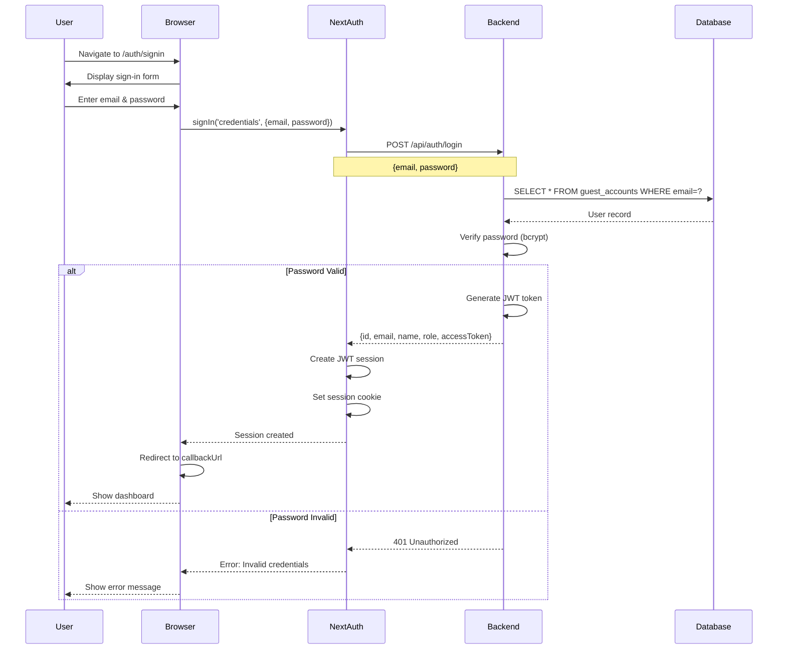

## 2. Session Management Flow

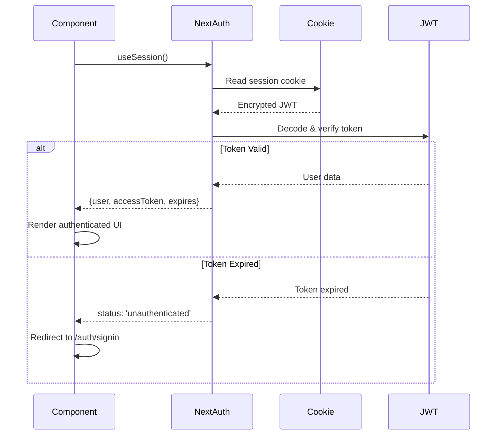

## 3. Protected Route Flow

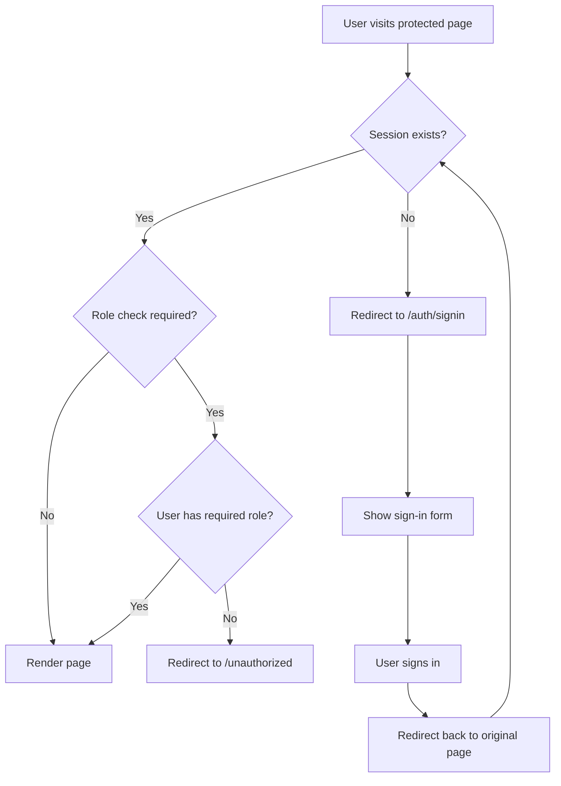

## 4. Registration Flow

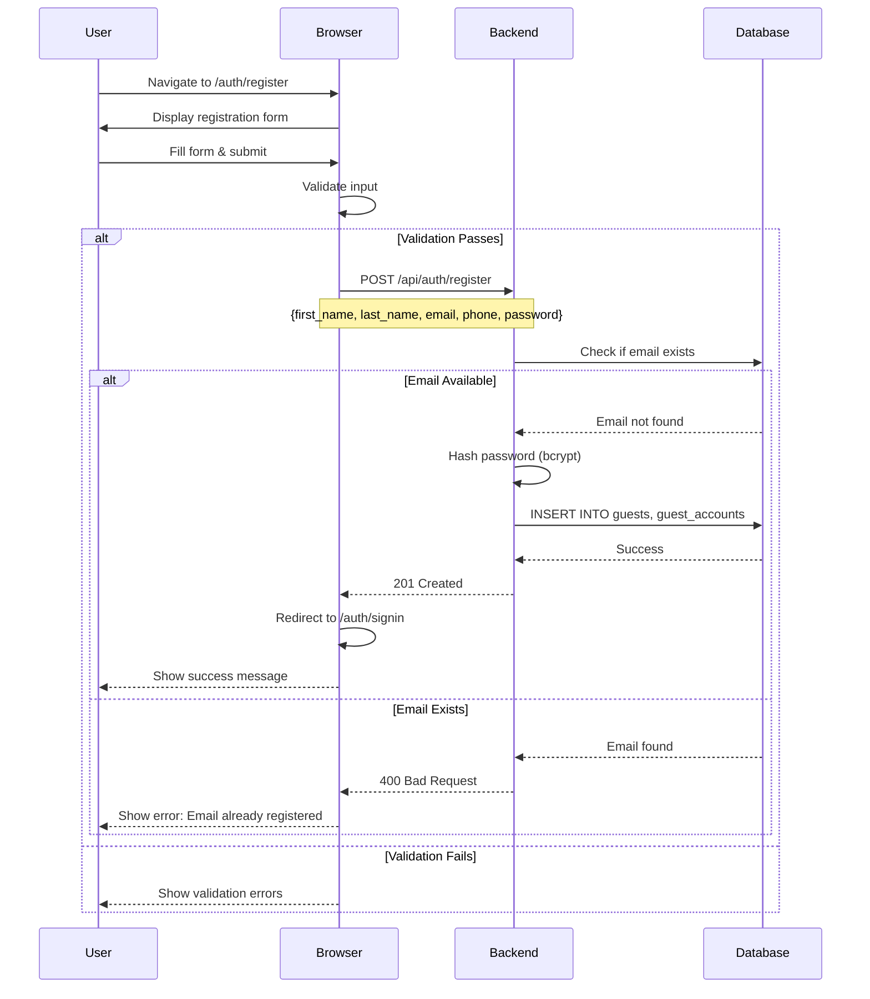

## 5. Sign Out Flow

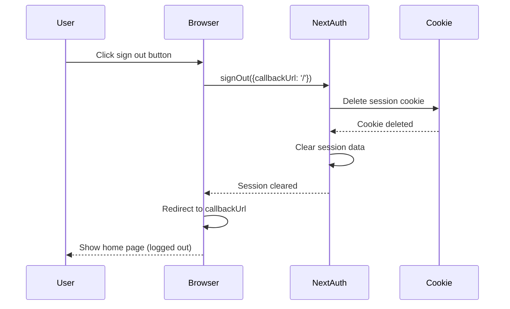

## 6. API Call with Authentication

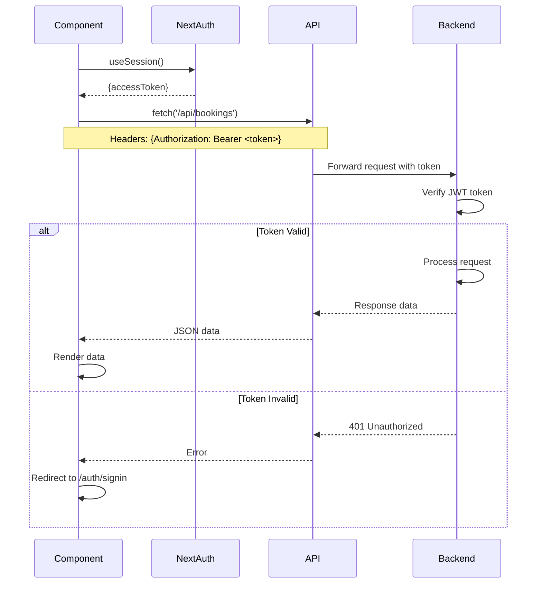

## 7. Session Refresh Flow

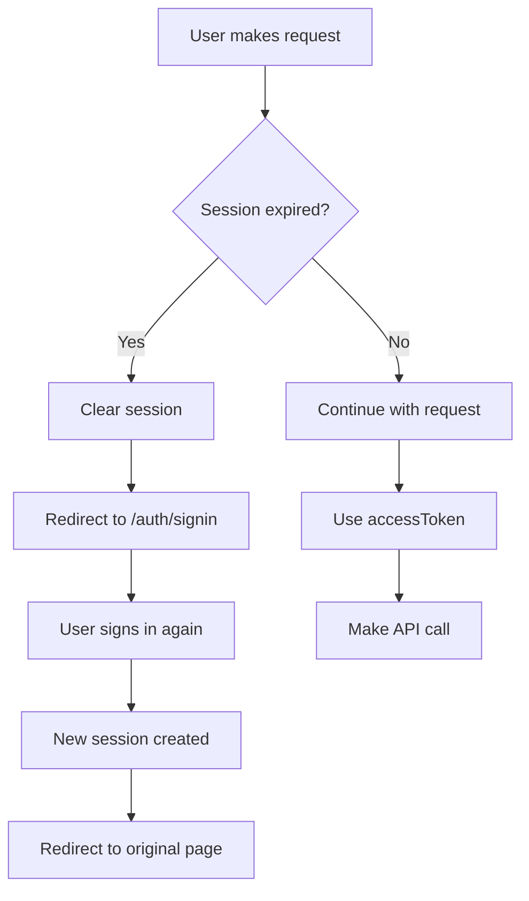

## 8. Role-Based Access Control

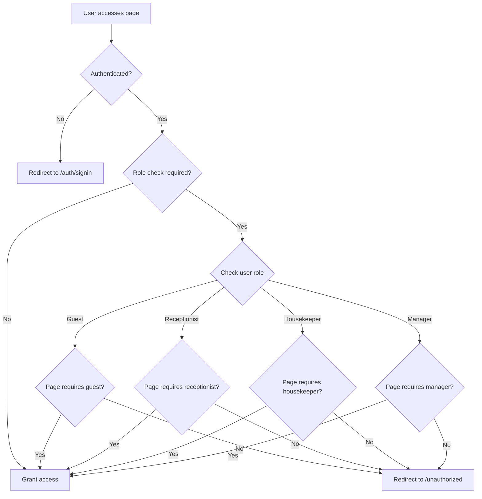

## 9. Complete Authentication Lifecycle

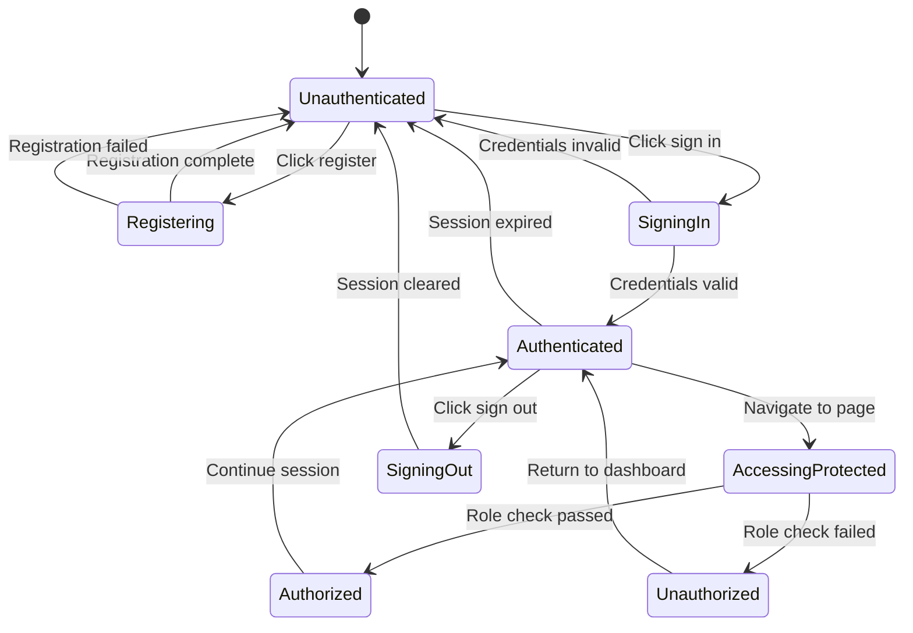

## 10. Error Handling Flow

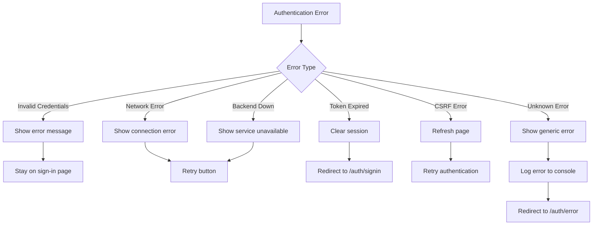

## Component Interaction Diagram

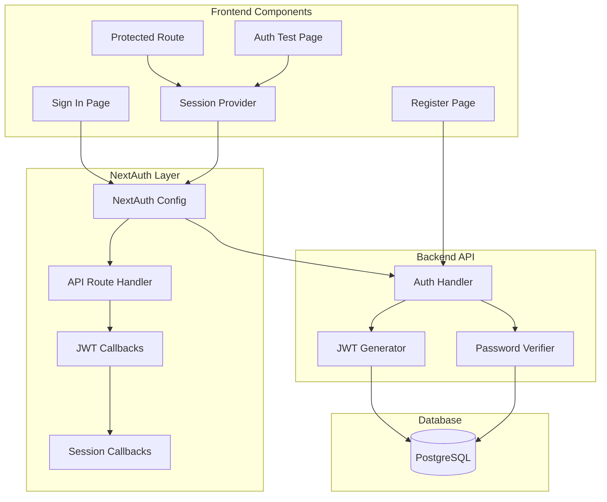

## Data Flow Diagram

```mermaid
flowchart LR
    A[User Input] --> B[Form Validation]
    B --> C[NextAuth Provider]
    C --> D[Backend API]
    D --> E[Database Query]
    E --> F[Password Check]
    F --> G[JWT Generation]
    G --> H[Session Creation]
    H --> I[Cookie Storage]
    I --> J[User Dashboard]
    
    style A fill:#e1f5ff
    style J fill:#c8e6c9
    style F fill:#fff9c4
    style G fill:#fff9c4
```

## Security Flow

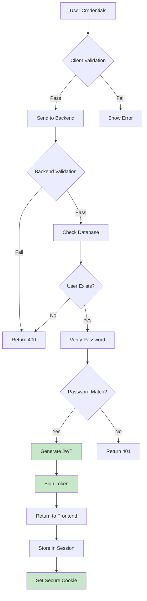

## Notes

- All diagrams use Mermaid syntax for easy rendering
- Flows show both success and error paths
- Security considerations are highlighted
- Role-based access control is clearly defined
- Session management lifecycle is complete

## Usage

These diagrams can be rendered in:
- GitHub (native Mermaid support)
- VS Code (with Mermaid extension)
- Documentation sites (with Mermaid plugin)
- Markdown viewers (with Mermaid support)
