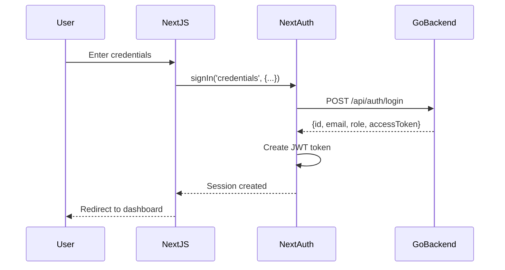
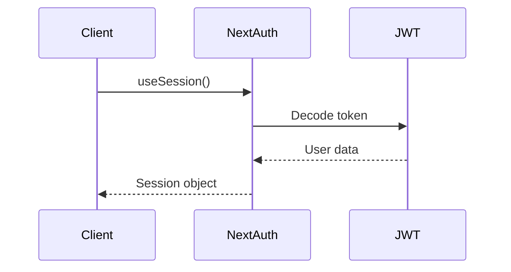

# NextAuth.js Setup Documentation

## Overview

This document describes the NextAuth.js v5 (beta) implementation for the hotel booking system. NextAuth provides secure authentication with JWT tokens and integrates with the Go backend API.

## Architecture

```
┌─────────────────┐
│  Next.js Client │
│   (Browser)     │
└────────┬────────┘
         │
         ▼
┌─────────────────┐
│   NextAuth.js   │
│  (Middleware)   │
└────────┬────────┘
         │
         ▼
┌─────────────────┐
│   Go Backend    │
│  /api/auth/*    │
└─────────────────┘
```

## Files Structure

```
frontend/
├── src/
│   ├── app/
│   │   ├── api/
│   │   │   └── auth/
│   │   │       └── [...nextauth]/
│   │   │           └── route.ts          # NextAuth API route
│   │   └── auth/
│   │       ├── signin/
│   │       │   └── page.tsx              # Custom sign-in page
│   │       ├── register/
│   │       │   └── page.tsx              # Registration page
│   │       ├── error/
│   │       │   └── page.tsx              # Error page
│   │       └── test/
│   │           └── page.tsx              # Test page
│   ├── lib/
│   │   └── auth.ts                       # NextAuth configuration
│   └── components/
│       ├── providers.tsx                 # SessionProvider wrapper
│       └── protected-route.tsx           # Protected route component
└── .env.local                            # Environment variables
```

## Configuration

### Environment Variables (.env.local)

```env
# Backend API URL (client-side)
NEXT_PUBLIC_API_URL=http://localhost:8080/api

# Backend URL (server-side, for NextAuth)
BACKEND_URL=http://backend:8080

# NextAuth Configuration
NEXTAUTH_URL=http://localhost:3000
NEXTAUTH_SECRET=hotel-booking-secret-key-change-in-production-2024
```

### NextAuth Configuration (src/lib/auth.ts)

Key features:
- **CredentialsProvider**: Authenticates against Go backend
- **JWT Strategy**: Uses JWT tokens for session management
- **Custom Callbacks**: Extends JWT and session with user data
- **Type Extensions**: TypeScript types for user and session

## Authentication Flow

### 1. Sign In Flow



### 2. Session Management



## API Endpoints

### NextAuth Endpoints (Auto-generated)

- `GET /api/auth/signin` - Sign in page
- `POST /api/auth/signin` - Sign in handler
- `GET /api/auth/signout` - Sign out page
- `POST /api/auth/signout` - Sign out handler
- `GET /api/auth/session` - Get current session
- `GET /api/auth/csrf` - Get CSRF token
- `GET /api/auth/providers` - Get available providers

### Backend Endpoints (Go)

- `POST /api/auth/register` - Register new user
- `POST /api/auth/login` - Login (called by NextAuth)
- `GET /api/auth/me` - Get current user info

## Usage Examples

### 1. Client Component with Authentication

```tsx
'use client';

import { useSession } from 'next-auth/react';

export default function MyComponent() {
  const { data: session, status } = useSession();

  if (status === 'loading') {
    return <div>Loading...</div>;
  }

  if (status === 'unauthenticated') {
    return <div>Please sign in</div>;
  }

  return (
    <div>
      <h1>Welcome, {session.user.name}</h1>
      <p>Role: {session.user.role}</p>
      <p>Email: {session.user.email}</p>
    </div>
  );
}
```

### 2. Server Component with Authentication

```tsx
import { auth } from '@/lib/auth';
import { redirect } from 'next/navigation';

export default async function ServerPage() {
  const session = await auth();

  if (!session) {
    redirect('/auth/signin');
  }

  return (
    <div>
      <h1>Server Component</h1>
      <p>User: {session.user.email}</p>
    </div>
  );
}
```

### 3. Protected Route

```tsx
import { ProtectedRoute } from '@/components/protected-route';

export default function ManagerPage() {
  return (
    <ProtectedRoute requiredRole={['manager']}>
      <div>Manager Dashboard</div>
    </ProtectedRoute>
  );
}
```

### 4. Sign Out

```tsx
'use client';

import { signOut } from 'next-auth/react';
import { Button } from '@/components/ui/button';

export function SignOutButton() {
  return (
    <Button onClick={() => signOut({ callbackUrl: '/' })}>
      Sign Out
    </Button>
  );
}
```

### 5. API Call with Token

```tsx
'use client';

import { useSession } from 'next-auth/react';

export function useAuthenticatedFetch() {
  const { data: session } = useSession();

  const fetchWithAuth = async (url: string, options: RequestInit = {}) => {
    const headers = {
      ...options.headers,
      'Authorization': `Bearer ${session?.accessToken}`,
      'Content-Type': 'application/json',
    };

    return fetch(url, { ...options, headers });
  };

  return fetchWithAuth;
}
```

## Session Object Structure

```typescript
{
  user: {
    id: string;           // User ID from backend
    email: string;        // User email
    name: string;         // User name
    role: string;         // User role (guest, receptionist, housekeeper, manager)
  },
  accessToken: string;    // JWT token from backend
  expires: string;        // Session expiry time
}
```

## Testing

### Test Pages

1. **Auth Test Page**: `/auth/test`
   - View current session
   - Test login/logout
   - Inspect session data

### Manual Testing Steps

1. **Test Registration**:
   ```bash
   # Navigate to registration page
   http://localhost:3000/auth/register
   
   # Fill in form and submit
   # Should redirect to sign-in page
   ```

2. **Test Sign In**:
   ```bash
   # Navigate to sign-in page
   http://localhost:3000/auth/signin
   
   # Use test credentials:
   Email: test@example.com
   Password: password123
   
   # Should redirect to home page with session
   ```

3. **Test Session**:
   ```bash
   # Navigate to test page
   http://localhost:3000/auth/test
   
   # Should show session data if authenticated
   ```

4. **Test Protected Route**:
   ```bash
   # Try accessing protected page without login
   # Should redirect to sign-in page
   ```

5. **Test Sign Out**:
   ```bash
   # Click sign out button
   # Session should be cleared
   # Should redirect to home page
   ```

### Testing with Backend

Ensure the Go backend is running:

```bash
cd backend
make run
```

Test backend authentication:

```bash
# Register a user
curl -X POST http://localhost:8080/api/auth/register \
  -H "Content-Type: application/json" \
  -d '{
    "first_name": "Test",
    "last_name": "User",
    "email": "test@example.com",
    "phone": "0812345678",
    "password": "password123"
  }'

# Login
curl -X POST http://localhost:8080/api/auth/login \
  -H "Content-Type: application/json" \
  -d '{
    "email": "test@example.com",
    "password": "password123"
  }'
```

## Security Considerations

1. **NEXTAUTH_SECRET**: Change in production to a strong random string
2. **HTTPS**: Always use HTTPS in production
3. **Token Expiry**: JWT tokens expire after 24 hours
4. **CSRF Protection**: NextAuth handles CSRF automatically
5. **Password Hashing**: Backend uses bcrypt for password hashing

## Troubleshooting

### Issue: "Invalid token" error

**Solution**: Check that NEXTAUTH_SECRET matches between restarts

### Issue: "Cannot connect to backend"

**Solution**: Verify BACKEND_URL is correct and backend is running

### Issue: Session not persisting

**Solution**: Check browser cookies are enabled

### Issue: TypeScript errors

**Solution**: Restart TypeScript server or run `npm run build`

## Requirements Mapping

This implementation satisfies the following requirements:

- **1.1**: User registration with email and password
- **1.2**: Email uniqueness validation
- **1.3**: Login with credentials and LastLogin update
- **1.4**: Profile update capability
- **1.5**: Email format validation
- **1.6**: Password reset functionality (structure in place)

## Next Steps

After completing this task, you can:

1. Implement role-based access control for different user types
2. Add password reset functionality
3. Implement email verification
4. Add OAuth providers (Google, Facebook, etc.)
5. Implement refresh token rotation
6. Add rate limiting for authentication endpoints

## References

- [NextAuth.js v5 Documentation](https://next-auth.js.org/)
- [NextAuth.js GitHub](https://github.com/nextauthjs/next-auth)
- [JWT.io](https://jwt.io/)
