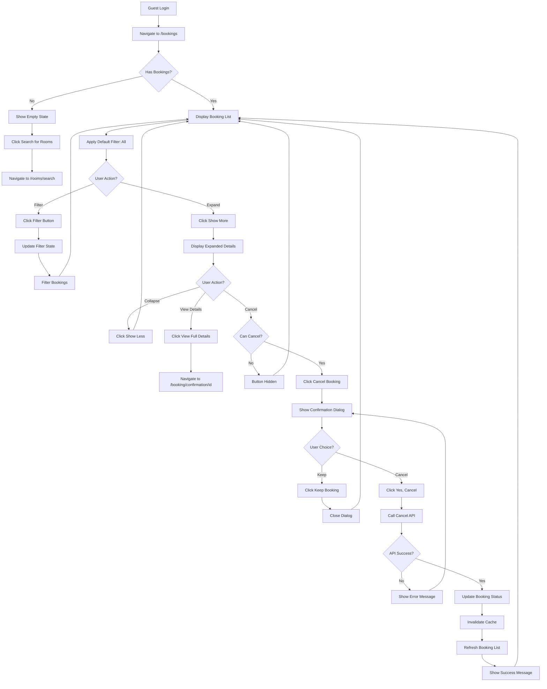
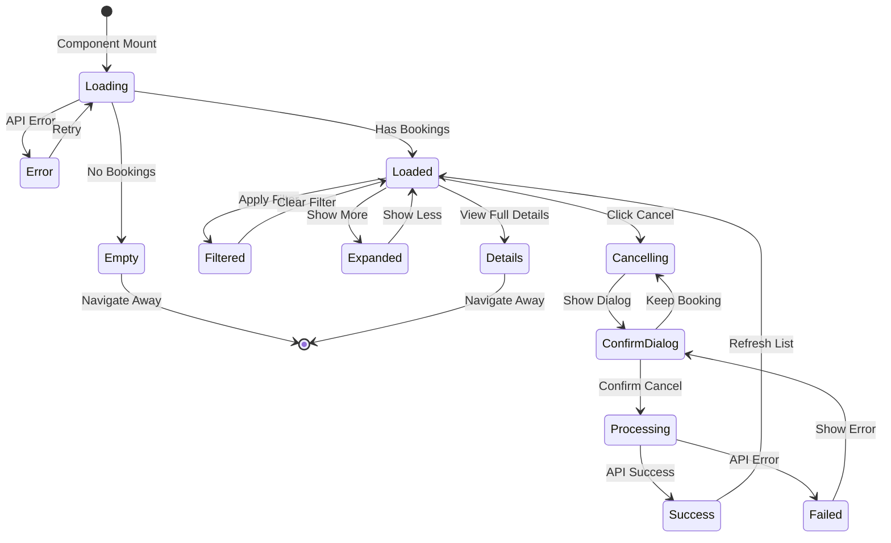
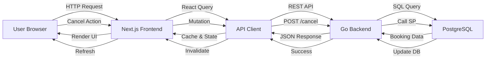
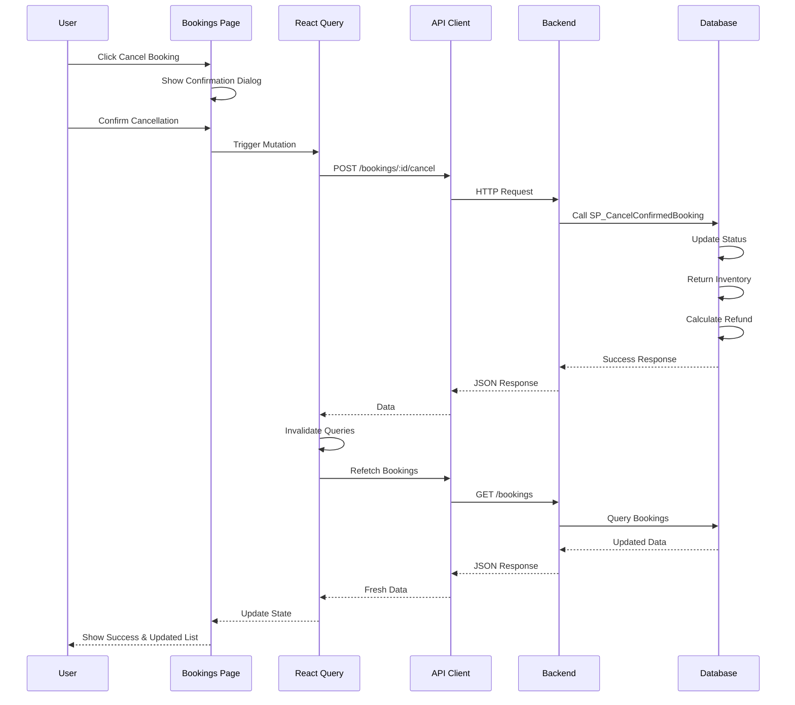
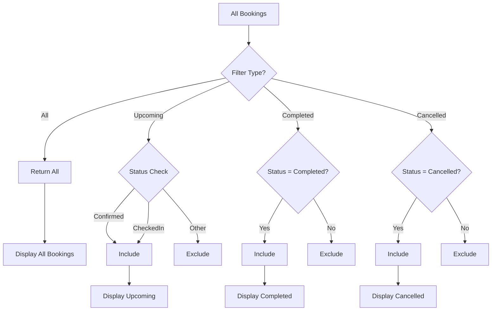
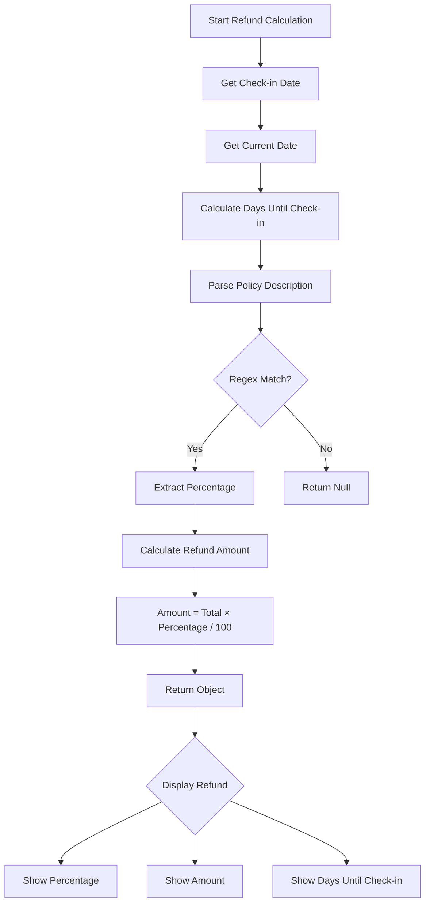
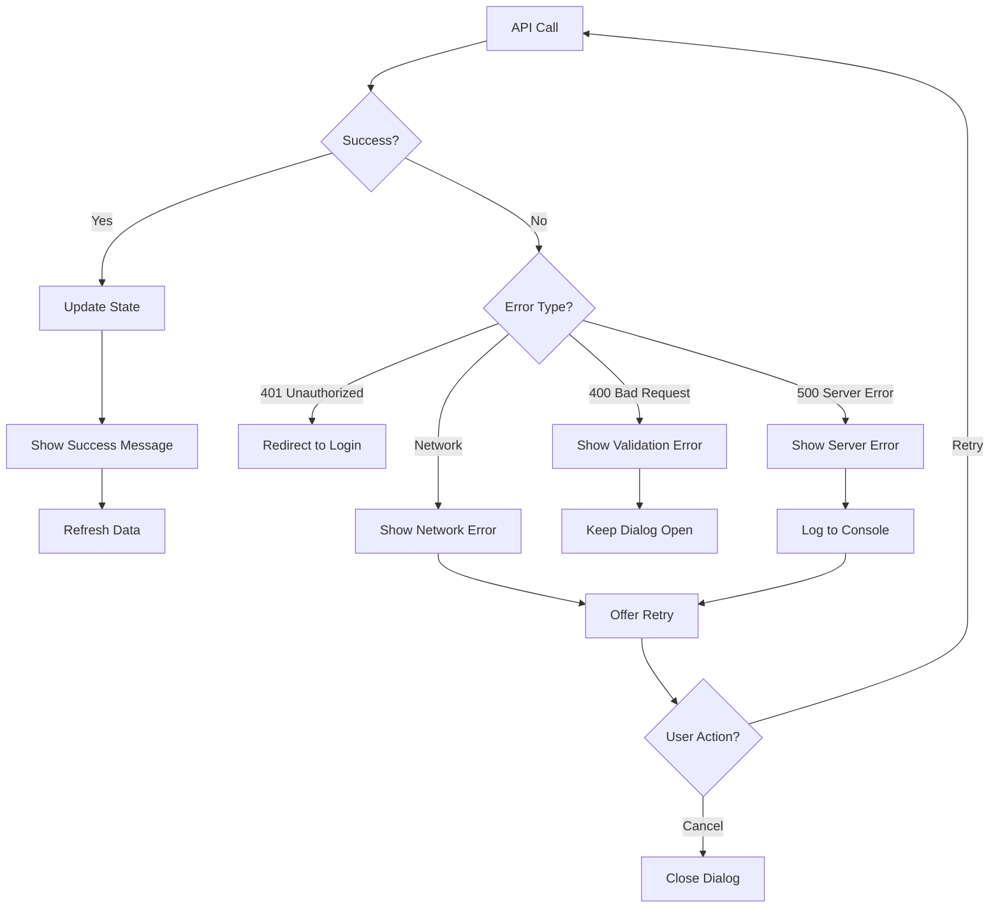
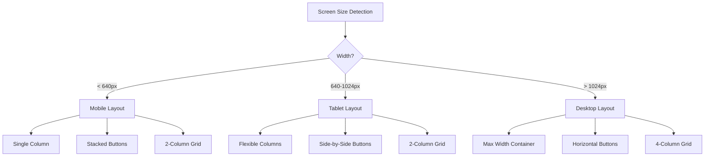
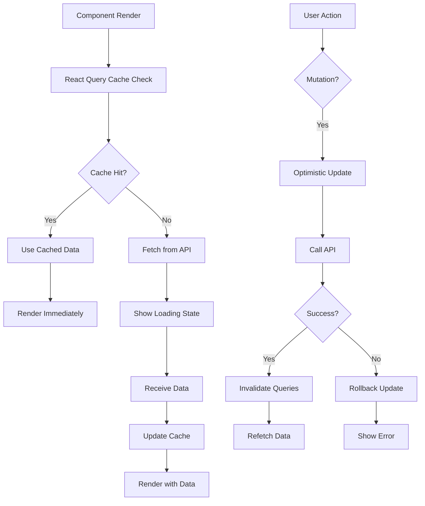

# Booking History Flow Diagram

## User Journey Flow



## Component State Flow



## Data Flow Architecture



## Cancel Booking Sequence



## Filter Logic Flow



## Refund Calculation Flow



## Component Hierarchy

```
BookingsPage
├── Header
│   ├── Title
│   └── Description
├── StatusFilter
│   ├── AllButton
│   ├── UpcomingButton
│   ├── CompletedButton
│   └── CancelledButton
├── BookingsList
│   └── BookingCard (multiple)
│       ├── BookingHeader
│       │   ├── BookingID
│       │   └── StatusBadge
│       ├── BookingInfo
│       │   ├── CheckInDate
│       │   ├── CheckOutDate
│       │   ├── Guests
│       │   └── TotalAmount
│       ├── ExpandedDetails (conditional)
│       │   ├── RoomDetails
│       │   ├── GuestInformation
│       │   ├── CancellationPolicy
│       │   ├── RefundCalculation
│       │   └── NightlyBreakdown
│       └── ActionButtons
│           ├── ShowMoreButton
│           ├── ViewDetailsButton
│           └── CancelButton (conditional)
└── CancelDialog (conditional)
    ├── DialogHeader
    ├── WarningMessage
    ├── RefundDisplay
    └── DialogActions
        ├── KeepButton
        └── ConfirmButton
```

## State Management

```mermaid
graph TD
    A[Component State] --> B[statusFilter: string]
    A --> C[expandedBooking: number | null]
    A --> D[cancellingBooking: number | null]
    
    E[React Query State] --> F[bookings: Booking[]]
    E --> G[isLoading: boolean]
    E --> H[error: Error | null]
    
    I[Mutation State] --> J[cancelBooking.isPending]
    I --> K[cancelBooking.isSuccess]
    I --> L[cancelBooking.isError]
```

## Error Handling Flow



## Responsive Layout Flow



## Performance Optimization Flow



## Summary

These diagrams illustrate:

1. **User Journey**: Complete flow from login to cancellation
2. **Component State**: State transitions and management
3. **Data Flow**: How data moves through the system
4. **Cancel Sequence**: Detailed cancellation process
5. **Filter Logic**: How filtering works
6. **Refund Calculation**: Refund computation process
7. **Component Hierarchy**: UI structure
8. **State Management**: State organization
9. **Error Handling**: Error flow and recovery
10. **Responsive Layout**: Layout adaptation
11. **Performance**: Optimization strategies

Use these diagrams as reference for understanding the booking history implementation.
