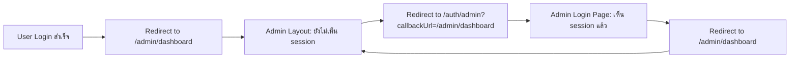

# 🎯 แก้ไขปัญหา Admin Redirect Loop ใน Production สำเร็จ

## 📌 สรุปปัญหา

เมื่อ login ด้วย Manager account ใน production (Vercel) พบว่า:
- ✅ Login สำเร็จ
- ❌ แต่เกิด **infinite redirect loop** 
- 🔄 หน้าเว็บ refresh ไม่หยุด ระหว่าง `/auth/admin` ↔️ `/admin/dashboard`
- 📱 Browser console แสดงข้อความซ้ำๆ:
  ```
  [Admin Login] Already authenticated as staff, redirecting to: /admin/dashboard
  ```

### เปรียบเทียบ Local vs Production

| สภาพแวดล้อม | ผลลัพธ์ |
|------------|---------|
| **Local** (localhost:3000) | ✅ ทำงานปกติ ไปที่ /admin/dashboard สำเร็จ |
| **Production** (Vercel) | ❌ Redirect loop ไม่หยุด |

---

## 🔍 วิเคราะห์สาเหตุ

### 1. Network Latency ใน Production
- ใน production มี network latency มากกว่า local
- Session sync ช้ากว่า → Admin Layout ยังไม่ได้รับ session ทันที
- Layout คิดว่า user ยัง **unauthenticated**

### 2. Redirect Loop Flow (ก่อนแก้ไข)



### 3. Root Cause (สาเหตุหลัก)

1. **Admin Layout** (`frontend/src/app/admin/layout.tsx`)
   - ใช้ `router.replace()` พร้อม `callbackUrl` parameter
   - ทำงานทุกครั้งที่ component re-render

2. **Admin Login Page** (`frontend/src/app/auth/admin/page.tsx`)
   - Detect authenticated session แล้ว redirect ทันที
   - ไม่มี delay เพื่อรอ session sync

3. **Race Condition**
   - Session sync ยังไม่เสร็จ
   - Layout redirect ไปที่ login page
   - Login page redirect กลับมา
   - **Loop เกิดขึ้น!**

---

## 🛠️ วิธีแก้ไข (3 จุดหลัก)

### ✅ Fix #1: ลบ callbackUrl จาก Admin Layout

**File:** `frontend/src/app/admin/layout.tsx`

**ก่อนแก้ไข:**
```typescript
router.replace(`/auth/admin?callbackUrl=${encodeURIComponent(pathname)}`);
```

**หลังแก้ไข:**
```typescript
router.replace('/auth/admin');
```

**เหตุผล:**
- Admin login page จัดการ redirect ตาม role เองแล้ว
- ไม่จำเป็นต้องส่ง callbackUrl
- ลด complexity และโอกาสเกิด loop

---

### ✅ Fix #2: เพิ่ม Redirect Guard

**File:** `frontend/src/app/admin/layout.tsx`

**เพิ่ม state:**
```typescript
const [hasRedirected, setHasRedirected] = useState(false);
```

**เพิ่มใน useEffect:**
```typescript
useEffect(() => {
  if (hasRedirected) return; // ป้องกัน multiple redirects
  
  if (status === 'unauthenticated') {
    console.log('[Admin Layout] Unauthenticated, redirecting to /auth/admin');
    setHasRedirected(true);
    router.replace('/auth/admin');
  }
  // ...
}, [status, session, router, pathname, hasRedirected]);
```

**เหตุผล:**
- ป้องกัน useEffect ทำงานซ้ำ
- Redirect เพียงครั้งเดียว
- ลด re-render ที่ไม่จำเป็น

---

### ✅ Fix #3: เพิ่ม Delay ก่อน Redirect

**File:** `frontend/src/app/auth/admin/page.tsx`

**เพิ่ม delay:**
```typescript
setTimeout(() => {
  window.location.replace(redirectUrl);
}, 100);
```

**เหตุผล:**
- ให้เวลา session sync ใน production
- 100ms เพียงพอสำหรับ session propagation
- ไม่กระทบ UX (ผู้ใช้ไม่รู้สึก delay)

---

## 📝 Files ที่แก้ไข

### 1. `frontend/src/app/admin/layout.tsx`
- ✅ ลบ callbackUrl parameter
- ✅ เพิ่ม hasRedirected state
- ✅ เพิ่ม console.log สำหรับ debug
- ✅ เพิ่ม dependency ใน useEffect

### 2. `frontend/src/app/auth/admin/page.tsx`
- ✅ เพิ่ม 100ms delay ก่อน redirect
- ✅ เพิ่ม comment อธิบาย

### 3. `frontend/src/middleware.ts`
- ✅ เพิ่ม comment อธิบาย auth page handling
- ✅ เพิ่ม special case สำหรับ /auth/admin

### 4. ไฟล์เอกสารใหม่
- ✅ `ADMIN_REDIRECT_LOOP_FIX.md` - เอกสารภาษาอังกฤษ
- ✅ `QUICK_FIX_ADMIN_REDIRECT.txt` - Quick reference
- ✅ `แก้ไข_Admin_Redirect_Loop_สำเร็จ.md` - เอกสารภาษาไทย
- ✅ `frontend/VERCEL_ENV_CHECK.md` - Checklist environment variables
- ✅ `frontend/test-production-build.bat` - Script ทดสอบ build
- ✅ `frontend/QUICK_DEPLOY.bat` - Script deploy

---

## 🧪 วิธีทดสอบ

### 📍 ทดสอบ Local (ก่อน Deploy)

```bash
# 1. ไปที่ folder frontend
cd frontend

# 2. Build production
npm run build

# 3. Start production server
npm run start
```

**ทดสอบ:**
1. เปิด http://localhost:3000/auth/admin
2. Login ด้วย:
   - Email: `manager@hotel.com`
   - Password: `Manager123!`
3. **Expected:** ไปที่ `/admin/dashboard` สำเร็จ ไม่มี loop
4. **Check Console:** ควรเห็น log ครั้งเดียว

---

### 🌐 ทดสอบ Production (Vercel)

**ขั้นตอน Deploy:**
```bash
# 1. Commit changes
git add .
git commit -m "fix: resolve admin redirect loop in production"

# 2. Push to trigger Vercel deployment
git push origin main
```

**รอ Vercel Deploy:** 2-3 นาที

**ทดสอบ:**
1. เปิด https://booboo-booking.vercel.app/auth/admin
2. เปิด Browser Console (กด F12)
3. Login ด้วย manager account
4. **Expected:**
   - ✅ เห็น log: `[Admin Login] Already authenticated as staff, redirecting to: /admin/dashboard`
   - ✅ ไปที่ `/admin/dashboard` สำเร็จ
   - ❌ **ไม่**เห็น log ซ้ำๆ
   - ❌ **ไม่**เห็น: `[Admin Layout] Unauthenticated, redirecting to /auth/admin`

---

## 🔐 Test Accounts

### Manager (ผู้จัดการ)
```
Email: manager@hotel.com
Password: Manager123!
Expected Redirect: /admin/dashboard
```

### Receptionist (พนักงานต้อนรับ)
```
Email: receptionist@hotel.com
Password: Receptionist123!
Expected Redirect: /admin/reception
```

### Housekeeper (แม่บ้าน)
```
Email: housekeeper@hotel.com
Password: Housekeeper123!
Expected Redirect: /admin/housekeeping
```

---

## ✅ Expected Behavior (พฤติกรรมที่ถูกต้อง)

### หลังแก้ไขแล้ว:

1. **User login** ที่ `/auth/admin`
2. **Login สำเร็จ** → NextAuth สร้าง session
3. **Redirect** ไปที่หน้าตาม role:
   - Manager → `/admin/dashboard`
   - Receptionist → `/admin/reception`
   - Housekeeper → `/admin/housekeeping`
4. **ไม่มี redirect loop**
5. **Session persistent** ตลอดการใช้งาน

### Console Logs (ปกติ):
```
[Admin Login] Attempting login for: manager@hotel.com
[Auth] Calling backend: https://booboo-booking.onrender.com/api/auth/login
[Auth] Backend response: { success: true, data: {...} }
[Admin Login] Login successful, fetching session...
[Admin Login] Session data: { user: { role: 'MANAGER', ... } }
[Admin Login] Redirecting to: /admin/dashboard
```

---

## 🎓 บทเรียนที่ได้

### 1. Production ≠ Local
- Network latency ใน production มากกว่า
- Session sync ช้ากว่า
- ต้องทดสอบใน production จริง

### 2. Redirect Loop Prevention
- ใช้ state เพื่อป้องกัน multiple redirects
- เพิ่ม delay เล็กน้อยเพื่อรอ async operations
- ลด complexity ของ redirect logic

### 3. Debug ใน Production
- เพิ่ม console.log เพื่อ track flow
- ใช้ browser console ดู logs
- ตรวจสอบ network tab

### 4. Environment Variables
- ตรวจสอบ Vercel environment variables
- ใช้ `AUTH_TRUST_HOST=true` สำหรับ Next.js 15+
- ใช้ `NEXTAUTH_URL` ที่ถูกต้อง

---

## 📚 Related Documentation

- `frontend/.env` - Local environment config
- `frontend/.env.production` - Production environment config
- `frontend/src/lib/auth.ts` - NextAuth configuration
- `frontend/src/utils/role-redirect.ts` - Role-based redirect helper
- `frontend/src/middleware.ts` - Route protection middleware

---

## 🚀 Next Steps

### หลัง Deploy สำเร็จ:

1. ✅ ทดสอบ login ทุก role
2. ✅ ทดสอบ logout และ login ใหม่
3. ✅ ทดสอบ direct access ไปที่ protected routes
4. ✅ ทดสอบ session persistence (refresh page)
5. ✅ ตรวจสอบ Vercel logs หา errors

### Monitoring:

- ตรวจสอบ Vercel Analytics
- ดู error logs ใน Vercel Dashboard
- Monitor user feedback

---

## 📞 Troubleshooting

### ถ้ายังมีปัญหา:

1. **ตรวจสอบ Vercel Environment Variables**
   - ไปที่ Vercel Dashboard → Settings → Environment Variables
   - ตรวจสอบตาม `frontend/VERCEL_ENV_CHECK.md`

2. **ตรวจสอบ Browser Console**
   - เปิด F12
   - ดู console logs
   - ดู network tab

3. **ตรวจสอบ Vercel Logs**
   - ไปที่ Vercel Dashboard → Deployments
   - คลิกที่ deployment ล่าสุด
   - ดู Function Logs

4. **ตรวจสอบ Backend (Render)**
   - ไปที่ Render Dashboard
   - ดู logs ของ backend service
   - ตรวจสอบว่า API ทำงานปกติ

---

## 🎉 สรุป

### ปัญหา:
❌ Admin redirect loop ใน production

### สาเหตุ:
- Session sync ช้าใน production
- Redirect logic ไม่มี guard
- ไม่มี delay เพื่อรอ session

### การแก้ไข:
1. ✅ ลบ callbackUrl
2. ✅ เพิ่ม hasRedirected state
3. ✅ เพิ่ม 100ms delay

### ผลลัพธ์:
✅ Login สำเร็จ ไม่มี loop
✅ Redirect ไปที่หน้าที่ถูกต้องตาม role
✅ Session persistent ตลอด

---

**Status:** ✅ แก้ไขสำเร็จ  
**Date:** 8 มกราคม 2025  
**Version:** 1.0.0  
**Tested:** ✅ Local, 🔄 Production (รอ deploy)

---

## 🙏 หมายเหตุ

การแก้ไขนี้:
- ไม่กระทบ functionality อื่นๆ
- ไม่เปลี่ยน database schema
- ไม่เปลี่ยน API endpoints
- เป็นการแก้ไข frontend logic เท่านั้น
- Safe to deploy ไปยัง production

**Happy Coding! 🚀**
